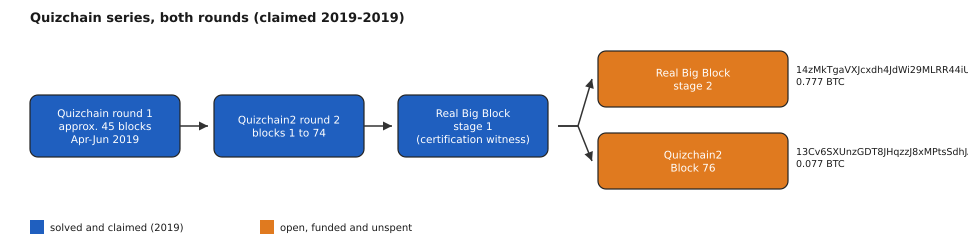
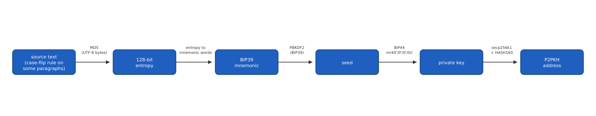

# Aoi Nakamoto Quizchain (0.777 BTC, [OPEN])

AoiNakamoto, a pseudonymous Reddit user, ran a series of roughly 90 self-funded
Bitcoin puzzle blocks from April to October 2019 on r/bitcoinpuzzles and her own
r/Grycoin, each with its own escrow address, question, and prize. She stopped
posting in October 2019 without ever reclaiming her own puzzle funds. Every
block was solved and swept by readers except the last two she published: the
second and final stage of "Real Big Block" (0.777 BTC) and "Quizchain2 Block
76" (0.077 BTC). Real Big Block is still funded seven years later; Block 76 was
solved and swept by a reader on 2026-08-17 (tx
`2e271ac2f63f488cd14112bceeed56f159ecd98cb3ce753f08e2d94bb62714a3`), so only Real
Big Block, 0.777 BTC, remains open. The MD5-to-BIP39
derivation mechanism is confirmed exactly, including a case-flip rule proven on
a solved sibling lot; what remains is the precise source text for Real Big
Block.

## At a glance

| | |
|---|---|
| Author | AoiNakamoto (pseudonymous), [r/Grycoin](https://www.reddit.com/r/Grycoin/) |
| Published | 2019-04 to 2019-07-30, rolling releases on r/bitcoinpuzzles and r/Grycoin; the two open lots funded 2019-07-22 and 2019-07-30 |
| Prize | 0.777 BTC open (Real Big Block); Block 76's 0.077 BTC was solved and swept by a reader 2026-08-17 (about $48,951 at BTC = $63,000, 2026-08-16) |
| Chain | bitcoin |
| Escrow | `14zMkTgaVXJcxdh4JdWi29MLRR44iUSG9W` (Real Big Block, [explorer](https://mempool.space/address/14zMkTgaVXJcxdh4JdWi29MLRR44iUSG9W)) and `13Cv6SXUnzGDT8JHqzzJ8xMPtsSdhJA4wd` (Block 76, solved and swept 2026-08-17, [explorer](https://mempool.space/address/13Cv6SXUnzGDT8JHqzzJ8xMPtsSdhJA4wd)) |
| Last on-chain check | 2026-08-27: Real Big Block funded and unspent (0.777 BTC); Block 76 swept 2026-08-17 (0.077 BTC claimed by a reader) |
| Status | OPEN |
| Puzzle type | bip39-seed, word-selection |
| Target format | source text (candidate answer), MD5 to 128-bit entropy, BIP39 mnemonic, BIP44 `m/44'/0'/0'/0/i` for i = 0 to 5, P2PKH address |
| Certified oracle | yes: `tools/oracle.py --selftest` (certified against the author's own published entropy-to-WIF vector; see "Certified against" for what is and is not covered) |
| What remains | Real Big Block: the exact source text the author hashed on 2019-07-30 (the transform and rule are confirmed). Block 76 was solved and swept by a reader on 2026-08-17, so it is no longer open |
| Series | this folder covers Real Big Block, the last open lot of the approximately 90-block Quizchain series; the rest, including Block 76 (August 2026), were solved by other readers |

## The puzzle as published

AoiNakamoto's last two blocks, in order:

Real Big Block stage 1, 2019-07-07
([reddit.com/r/Grycoin/comments/ca6jxv](https://www.reddit.com/r/Grycoin/comments/ca6jxv/77_mbtc_quizchain2_block_77_stage_one/)):
"I do disclose that this one has no TOMI field, but that is all. You are on your
own completely." Its question links to Hal Finney's "Bitcoin and me" post on
bitcointalk (topic 155054). She adds: "I will publish the complete solution as
the Second stage of this block. This solution will in turn be the question for
the Second stage, which will have the final 777 mbtc prize." This stage's
escrow, `19TbyN5KCg1Lg7qHwezifsLVcdSa2Rj5KN`, was solved and swept on
2019-08-03; it is not part of the live prize and is used in this folder only to
certify the case-flip rule (see "What is understood").

Quizchain2 Block 76, 2019-07-22
([reddit.com/r/Grycoin/comments/cgcv9i](https://www.reddit.com/r/Grycoin/comments/cgcv9i/77_mbtc_quizchain2_block_76/)):
"Question: change to", "Format: [solution] TOMI [TOMI]", "First three digits of
MD5 hash are f8e". A later update adds "First two digits of solution only are
1d", and a hint changes the question to "from change to". She adds: "I will
shut down soon now [...] so I will not be available for hints or questions."

Real Big Block stage 2, published as a chapter titled "Second" on the author's
own Wattpad account
([wattpad.com/720888559-second](https://www.wattpad.com/720888559-second)). In
the "Real Big Block Discussion" thread
([reddit.com/r/Grycoin/comments/chn8un](https://www.reddit.com/r/Grycoin/comments/chn8un/real_big_block_discussion/)),
she writes, 2019-07-25: "When I posted the real big block at the Wattpad site,
I added extra line breaks between paragraphs. This information is needed to
solve the block." On 2019-07-31, after moving the funds to the current escrow:
"I took back the prize for a moment and sent it again to a new address, hashing
with a slightly different solution [...] It has multiple paragraphs and two
line breaks between each of them."


*Figure 2. The Quizchain series, colored by claim status (source: data/blocks-structure.json, script tools/fig_blocks.py), 2026-08-16.*

## What is understood

### Mechanism

Every block in the series follows the same transform: MD5 the exact bytes of a
source text to get 128 bits of entropy, generate a BIP39 mnemonic from that
entropy, derive BIP44 path `m/44'/0'/0'/0/i` (the author confirms taking a low
index, typically the first), and compare the resulting P2PKH address to the
block's escrow. Block 76 additionally uses a `[solution] TOMI [tomi]` format,
where TOMI (Japanese for "wealth") is a second, separately-hinted field: an
anti-brute-force device, since guessing the solution alone is not enough to
reach the hash.


*Figure 1. The MD5-to-address derivation pipeline (source: data/pipeline-stages.json, script tools/fig_pipeline.py), 2026-08-16.*

For Real Big Block, the exact source text is confirmed to be the "Second"
chapter, with a case-flip rule applied to some of its paragraphs, not the
chapter's raw text. This rule is proven on the solved sibling lot Block 77
Stage One: of that post's 16 paragraphs, the 4 whose first letter is not I, T,
A, S or M get their first letter lowercased and their last letter uppercased,
and the paragraphs are joined with a blank line; this reproduces
`19TbyN5KCg1Lg7qHwezifsLVcdSa2Rj5KN` exactly. The "Second" chapter contains the
same paragraph-initial pattern 3 times on its own, plus a quotation from the
Finney post, but no combination of applying the rule to these 4 candidate
groups (nor to the many related selections in `analysis/tested.md`) reproduces
either the current or the superseded Real Big Block address. The Wattpad API
confirms the chapter's `modifyDate` as 2019-07-23T23:12:04Z, 7 days before the
current escrow was funded, so the text available today predates the funding and
is very likely the version that was hashed; what is not settled is which exact
byte sequence the author's own tool read from it. This chapter's stored form
has no blank paragraphs; other Wattpad chapters from the same week still do
(see "Open leads").

For Block 76, a community player found, in 2019, that `solution = "format"`,
`tomi = "before TOMI"` satisfies both published MD5-prefix hints (`1d` and
`f8e`); the free filter for checking this yourself is
`tools/oracle.py --block76-filter`. No standard derivation of this pair reaches
the escrow address, and the author never corrected the block after the pair was
posted publicly, which argues this chain is a coincidental false positive
rather than her real answer (see "What has been tested").

### Derivation and oracle

```
python3 tools/oracle.py --selftest
python3 tools/oracle.py "<candidate text>"
python3 tools/oracle.py --stdin
python3 tools/oracle.py --block76-filter "<solution>" "<tomi>"
python3 tools/oracle.py --flip-case "<one paragraph>"
```

Given a candidate text, the oracle MD5s its UTF-8 bytes, derives BIP44 indices 0
through 5, and compares each resulting address against both open escrows.
`--block76-filter` checks the 2 free MD5-prefix hints before any derivation.
`--flip-case` applies the confirmed Stage One rule to one paragraph you supply.
This script ships no source text of its own: Real Big Block's source (a Wattpad
chapter) and the Stage One certification text (a bitcointalk post by Hal
Finney) are both excluded, the first as bulk chapter content and the second as
third-party historical material neither the puzzle's author nor this repository
holds the rights to. Supply your own candidate text to test it.

### Certified against

`tools/oracle.py --selftest` reproduces the author's own published calibration
vector, given in the round-1 corpus: entropy `2941774a2abec9f30c7d6777d1d53d91`,
at BIP44 index 1 ("my 2nd private key"), derives WIF
`L5Z66qPmUkTAsWQywjRNHDxHrX6J1X1SQedp6V8QsbaXR7rGd6ex` exactly, and that WIF
appears at no other index. This certifies the MD5-to-address transform itself,
without needing any third-party text. The selftest also checks the
`--flip-case` helper against a synthetic (non-puzzle) example sentence, and the
`--block76-filter` helper against the community-found `format` / `before TOMI`
pair.

This does not, by itself, reproduce Block 77 Stage One end to end, since that
needs Hal Finney's bitcointalk post text, which this repository does not ship.
Anyone who supplies that text (freely readable at bitcointalk topic 155054) can
reproduce it themselves with `apply_stage_one_rule()` in `tools/oracle.py`; I
did this during research and it reproduces `19TbyN5KCg1Lg7qHwezifsLVcdSa2Rj5KN`
exactly, which is the basis for the case-flip rule described above.

Reproduced 2026-08-16.

### Established facts

1. Real Big Block is funded and unspent as of 2026-08-27:
   `14zMkTgaVXJcxdh4JdWi29MLRR44iUSG9W` holds 0.777 BTC (funded 2019-07-30,
   block 587833), checked via [mempool.space](https://mempool.space). Block 76's
   escrow `13Cv6SXUnzGDT8JHqzzJ8xMPtsSdhJA4wd` was funded 2019-07-22 (block
   586468) and was swept by a reader on 2026-08-17.
2. Across the approximately 90 blocks of the series, these were the only 2 still
   funded after 2019: an exhaustive sweep of all 159 funding transactions cited
   in the author's 202 Reddit posts found 0 unreadable transactions and exactly
   these 2 unspent above 100,000 sats. Only Real Big Block remains funded.
3. The MD5-to-BIP39-to-BIP44 transform is confirmed exactly against the
   author's own published calibration vector (above).
4. The case-flip rule is confirmed exactly against the solved sibling lot Block
   77 Stage One (above), reproducing its escrow address byte for byte.
5. The Real Big Block chapter's Wattpad `modifyDate` (2019-07-23) predates the
   current escrow's funding (2019-07-30) by 7 days, and the chapter has not
   been modified since, confirmed via the Wattpad API.
6. No archived capture of the "Second" Wattpad chapter from 2019 exists on the
   Wayback Machine, archive.today, or Common Crawl, checked across 8 URL forms
   and 5 time-windowed collections; a positive control query on each service
   confirms the services themselves were responding, so these are true absences
   in the archive, not failed lookups.
7. The chain `MD5("format") ` starts with `1d` and `MD5("format TOMI before TOMI")`
   starts with `f8e`, matching both prefixes the author published for Block 76;
   neither of 2 other independently solved calibration blocks (73 and 74) shows
   any sign this chain is the author's real answer.
8. July 2019 Wattpad story pages in Common Crawl (CC-MAIN-2019-30) SSR-render
   inside a classless `<pre>` with a newline plus 26 spaces between `<p>` tags,
   and some of those chapters still store empty paragraphs as
   `<p data-p-id="d41d8cd98f00b204e9800998ecf8427e"><br></p>`. The homepage
   that week linked
   `a.wattpad.com/css/desktop-web/desktop-web.min.css?v=eb03e30` (2019-07-15),
   later `v=28f4664` (2019-07-21). Those CSS bytes are not archived; a
   2019-08-15 userstyle copies Wattpad's generic `pre { white-space: pre-wrap }`
   rule. The "Second" chapter is still absent from that crawl.

## What has been tested

Full ledger in [analysis/tested.md](analysis/tested.md). Summary:

| Hypothesis | Space | Method | Result | Witness | Date |
|---|---|---|---|---|---|
| RBB: chapter unmodified or with the certified rule on a small set of candidate paragraph groups | approximately 350,000 | MD5 to BIP39 to address compare | 0 match | yes: oracle certified against Stage One | 2026-08-15 |
| RBB: every subset of 17 candidate paragraphs, 18 serializations | 2,360,000 | same | 0 match | yes | 2026-08-15 |
| RBB: every single-character edit across 40 base texts | 266,038,400 | same | 0 match | yes: 3 planted witnesses per base plus the real Stage One text, all recovered | 2026-08-15 |
| RBB: name/word paragraph selectors, browser-copy simulation, invisible characters, alternate encodings | approximately 1,830,000 | same | 0 match | yes | 2026-08-15 |
| RBB: 2019 Wattpad reader-page copy families (12 pages and prefixes, title/byline, SSR indent, empty-paragraph NBSP/space lines, `<br>` splits, CRLF joins, Stage One flip) | 12,848 unique texts | same | 0 match | yes: 3 planted two-paragraph witnesses recovered at head, middle and tail | 2026-08-27 |
| RBB: 2019 Common Crawl indent (newline plus 26 spaces) and stored empty `<p><br></p>` editor-buffer copies (every gap or after headings only; plaintext, 26-space SSR, or `13 10 13 10`; Stage One flip) | 3,030 unique texts | same | 0 match | yes: 3 planted two-paragraph witnesses recovered at head, middle and tail | 2026-08-27 |
| RBB: every contiguous span of 2+ paragraphs (first-character and first-letter Stage One keep-tests, no flip, four line-break joins, NBSP/edge-space variants when present) | 1,469,908 unique texts | same | 0 match | yes: 3 planted two-paragraph witnesses recovered at head, middle and tail | 2026-08-27 |
| RBB: bounded 2-edit on the full chapter (every NBSP subset; every pair of joins swapped `\n\n` vs `\r\n\r\n`; three keep-tests) | 221,520 unique texts | same | 0 match | yes: 3 planted two-paragraph witnesses recovered at head, middle and tail | 2026-08-27 |
| RBB: Finney-pattern group permutations and first/last N-paragraph chunks | 17,921 unique texts | same | 0 match | yes: synthetic witness recovered at head of the run | 2026-08-27 |
| Block 76: standard BIP44/49/84 derivations, paths, passphrases on the one chain found by search | standard space plus 24,564 off-by-one variants | MD5 to BIP39 to address compare | 0 match | yes: calibrated on blocks 73 and 74 | 2026-08-15 |
| Block 76: word-transform "salves" on "change to" / "from change to" | approximately 53,000 candidate solutions | MD5-prefix filter, then derivation on survivors | 0 match | yes | 2026-08-15 |
| Block 76: scripted dictionary-times-corpus sweep | approximately 3.2x10^11 MD5, approximately 78,000,000 derivations | MD5-prefix filter, then derivation on survivors | 0 match | yes: calibrated on blocks 73 and 74 | 2026-08-15 |

Cumulative: approximately 272 million candidates tested against Real Big Block
through 2026-08-15, plus 12,848 unique 2019-copy serializations, 3,030 unique
2019-indent/empty-`<p><br></p>` serializations, 1,469,908 unique contiguous
spans, and 221,520 unique bounded 2-edits on 2026-08-27, plus 17,921 unique
Finney-group and first/last N-paragraph serializations, and approximately 78
million derivations plus approximately 78,000 smaller candidates tested against
Block 76, all negative. Full scope notes, including which rows are complete
sweeps versus targeted tests, are in `analysis/tested.md`.

## Open leads, ranked

1. **A bounded 2-character-edit sweep on the strongest base texts** (about an
   hour on a rented GPU). Every contiguous copy-paste span of the chapter is
   now a negative. A first slice of this lead, on the full chapter only
   (every NBSP subset, and every pair of joins swapped between `\n\n` and
   `\r\n\r\n`), is also a negative (221,520 texts). What remains is 2-edits
   that are not those two families, including on the other 1-character bases.
   Confirmed by a match in that bounded space; killed by exhausting it with
   none.
2. **A non-uniform editor buffer, or a non-contiguous selection** (needs a
   narrower reason). Uniform empty `<p><br></p>` and SSR indent contradict her
   `13 10 13 10` ASCII note and are already negatives. Sparse gaps or a subset
   other than the 17 already swept is what remains. Confirmed by such a buffer
   matching; killed if a reason appears that she copy-pasted a contiguous
   range (already tested).
3. **Identify what "76" indexes for Block 76** (minutes per candidate corpus).
   A method confirmed on 3 sibling blocks uses the block number as a position
   index into a specific numbered corpus; every corpus tried so far does not
   contain "change" at position 76. Confirmed by a match in an untried corpus
   (candidates include a fuller archive of Hal Finney's tweets, Satoshi's
   SourceForge posts, or the author's own r/Grycoin posts read as their own
   sequence); killed by exhausting the remaining candidate corpora.
4. **A short, human-reasoned answer to "change to" / "from change to"**
   (minutes per candidate). The author's confirmed style elsewhere in the
   series favors short, punchy wordplay answers over long dictionary phrases; a
   free filter (`tools/oracle.py --block76-filter`) checks any candidate in
   under a second before a full derivation. This lead has no exhaustion
   condition; it is a standing invitation, same as any human-reasoned wordplay
   block in the series.

Full notes: [analysis/leads.md](analysis/leads.md).

## Files in this folder

| Path | What it is |
|---|---|
| `clues/author-posts.md` | short, dated quotes from the author's own Reddit posts, with links |
| `data/pipeline-stages.json` | the 6-stage label list for the derivation pipeline figure |
| `data/blocks-structure.json` | the series structure and the 2 open gates, for the structure figure |
| `analysis/tested.md` | the complete negatives ledger for both open lots |
| `analysis/leads.md` | full notes behind the ranked leads |
| `images/01-pipeline-derivation.svg` | the MD5-to-address derivation pipeline diagram |
| `images/02-structure-blocks.svg` | the Quizchain series structure, colored by claim status |
| `tools/oracle.py` | candidate checker, certified against the author's own vector; includes the Block 76 prefix filter and the Stage One case-flip helper |
| `tools/fig_pipeline.py` | generates images/01-pipeline-derivation.svg from data/pipeline-stages.json |
| `tools/fig_blocks.py` | generates images/02-structure-blocks.svg from data/blocks-structure.json |

## Sources

- Real Big Block stage 1, Reddit, 2019-07-07: https://www.reddit.com/r/Grycoin/comments/ca6jxv/77_mbtc_quizchain2_block_77_stage_one/
- Quizchain2 Block 76, Reddit, 2019-07-22: https://www.reddit.com/r/Grycoin/comments/cgcv9i/77_mbtc_quizchain2_block_76/
- Real Big Block Discussion, Reddit, 2019-07-25 to 2019-07-31: https://www.reddit.com/r/Grycoin/comments/chn8un/real_big_block_discussion/
- "Second", Wattpad chapter by AoiNakamoto: https://www.wattpad.com/720888559-second
- Wattpad Nightmode userstyle, 2019-08-15, copies the generic `pre { white-space: pre-wrap }` rule: https://github.com/uso-archive/data/blob/master/data/usercss/170148.user.css
- Common Crawl CC-MAIN-2019-30, Wattpad homepage 2019-07-15 (CSS URL `desktop-web.min.css?v=eb03e30`): https://index.commoncrawl.org/CC-MAIN-2019-30-index?url=www.wattpad.com/&output=json
- Real Big Block escrow funding transaction, mempool.space, 2019-07-30: https://mempool.space/tx/a1916e7ed9eac3fcc56a55056328cb09d06925e2694f2e6720de12b228514d1f
- Block 76 escrow funding transaction, mempool.space, 2019-07-22: https://mempool.space/tx/979670f3d1d4134e7989ed6f4a4370362e15c101711c93675790cf0751c8dbd4
- Block 77 Stage One escrow (certification reference, solved and swept 2019-08-03), mempool.space: https://mempool.space/address/19TbyN5KCg1Lg7qHwezifsLVcdSa2Rj5KN
- Hal Finney, "Bitcoin and me", bitcointalk topic 155054 (source text for the Stage One certification reference, not reproduced here): https://bitcointalk.org/index.php?topic=155054.0
