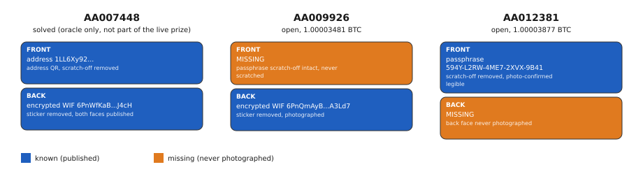
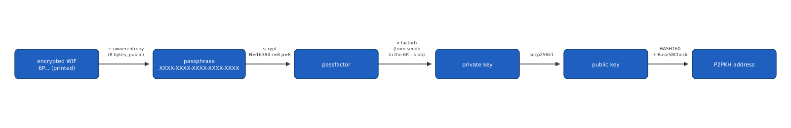

# Ballet / Bobby Lee: Take Bobby's Bitcoin (2.00007358 BTC, [OPEN])

Bobby Lee, CEO of hardware wallet maker Ballet and former CEO of the BTCC exchange,
announced this challenge on X on 2020-07-24: three physical Ballet REAL cards, each
holding 1 BTC, each missing one half of the two secrets needed to spend it. A card
needs both a BIP38-encrypted private key and a passphrase; Ballet removed the
tamper-evident sticker on one face of each card and the scratch-off on the other,
so exactly one half of each card's pair is public and the other stays hidden. One
card, AA007448, was solved and swept by a third party in 2020 and serves here only
as an oracle calibration vector. The other two, AA009926 and AA012381, are still
funded and unspent. The BIP38 EC-multiply decryption pipeline is fully confirmed;
what is missing for each open card is a photograph of the one physical face that was
never published.

## At a glance

| | |
|---|---|
| Author | Bobby Lee, [@bobbyclee on X](https://x.com/bobbyclee) |
| Published | 2020-07-24, X (Twitter) ([announcement](https://x.com/bobbyclee/status/1289004702122643456)) |
| Prize | 2.00007358 BTC across 2 cards (about $126,005 at BTC = $63,000, 2026-08-16) |
| Chain | bitcoin |
| Escrow | `1JxWyNrkgYvgsHu8hVQZqTXEB9RftRGP5m` (AA009926, [explorer](https://mempool.space/address/1JxWyNrkgYvgsHu8hVQZqTXEB9RftRGP5m)) and `1QGtbKxx6FKDD66LwnrzHCAHmyZ7mDHqC4` (AA012381, [explorer](https://mempool.space/address/1QGtbKxx6FKDD66LwnrzHCAHmyZ7mDHqC4)) |
| Last on-chain check | 2026-08-16: both funded and unspent (1.00003481 BTC and 1.00003877 BTC) |
| Status | OPEN |
| Puzzle type | bip38, physical-object |
| Target format | BIP38 EC-multiply encrypted WIF (blob prefix `0x0143`) plus a 20-character passphrase, compressed private key, P2PKH address |
| Certified oracle | yes: `tools/oracle.py --selftest` (certified against the solved sibling card AA007448) |
| What remains | one missing photograph per card, of the physical face that was never published |
| Series | none |

## The puzzle as published

Bobby Lee's announcement on X, 2020-07-24: three Ballet REAL cards, 1 BTC each, given
away as a hacking challenge. Ballet's own rules describe the mechanism directly:

> "The tamper-evident sticker concealing the encrypted private key has been removed
> from one wallet, and the scratch-off concealing the passphrase has been removed
> from the other."

No further characters, positions, or hints were published after the original
announcement; a follow-up tweet about 5 months later only noted the challenge was
still open. The 4 photographs that make up the public puzzle material for the 3
cards discussed here are mirrored, with the original addresses and BIP38 blobs, at
[github.com/oritwoen/boha](https://github.com/oritwoen/boha) (data as of 2026-08-16):
`clues/AA009926-puzzle.jpg` and `clues/AA009926-revealed.jpg` (front and back faces
of AA009926), `clues/AA012381-puzzle.jpg` (front face of AA012381, the only face of
this card published), and `clues/AA007448-puzzle.jpg` (the solved oracle card).

Each card has two physical faces. The front carries the plaintext address, an
address QR code, and the passphrase under scratch-off material. The back carries
the BIP38-encrypted WIF (a string starting `6P...`) under a tamper-evident sticker.
AA009926 publishes both faces, but its passphrase scratch-off was never scratched.
AA012381 publishes only its front face, with the passphrase scratch-off removed and
the passphrase `594Y-L2RW-4ME7-2XVX-9B41` plainly legible; its back face, carrying
the encrypted WIF, was never photographed.


*Figure 1. Which half of the BIP38 pair is known and which is missing, per card and per face (source: data/card-faces.json, script tools/fig_cards.py), 2026-08-16.*

## What is understood

### Mechanism

Recovering a card's private key needs both of its halves: the BIP38-encrypted WIF
and the passphrase. Both cards discussed here (AA007448, and the two open cards) are
BIP38 EC-multiply wallets (blob prefix `0x0143`, flag `0x20`, no lot or sequence
number), not the simpler non-EC BIP38 variant. The passphrase, combined with an
8-byte public salt printed inside the encrypted blob (`ownerentropy`), goes through
scrypt (N=16384, r=8, p=8) to produce an intermediate value, `passfactor`. The final
private key is `passfactor` multiplied by `factorb`, where `factorb` is derived from
`seedb`, a 24-byte value that is itself encrypted inside the `6P...` blob. The
private key derives a compressed public key over secp256k1, and HASH160 plus
Base58Check encoding gives the P2PKH address, which must equal the card's on-chain
address.


*Figure 2. The BIP38 EC-multiply derivation pipeline confirmed by the AA007448 oracle vector (source: data/pipeline-stages.json, script tools/fig_pipeline.py), 2026-08-16.*

### Derivation and oracle

```
python3 tools/oracle.py --selftest
python3 tools/oracle.py "<encrypted_wif> <passphrase> <address>"
```

The oracle decrypts the given encrypted WIF with the given passphrase (auto-detecting
BIP38 non-EC versus EC-multiply from the blob prefix), derives the P2PKH address
honoring the BIP38 compression flag, and compares it byte-exact to the given address.
`MATCH <address> WIF=<wif> priv_hex=<hex>` on a hit, `NO MATCH` otherwise, exit code
0 or 1.

### Certified against

`tools/oracle.py --selftest` reproduces the solved sibling card AA007448 byte for
byte: decrypting encrypted WIF `6PnWfKaBfDW6mFFhhFsbNRHnVgojUhdf2b5NXP3FfwXiQ69MxEzVK2J4cH`
with passphrase `335Y-K745-C8WT-4D2W-80WP` derives address
`1LL6Xy92LwGDRfQP9fBU7f1477cEKctr7c`, WIF
`L2mrYyo5a6rpyQdC88UitNeH5n1rAqPcq8Qv5gwtQE8KTvW3ZTeH`, and private key hex
`a5b9247400b7e31e54481f14828ced3a538af280e9eeb1229196c3cb5e7ecdde`. A wrong
passphrase against the same encrypted WIF is correctly rejected, with no false
positive. Reproduced 2026-08-16.

### Established facts

1. Both AA009926 and AA012381 are funded and unspent as of 2026-08-16 (checked via
   [mempool.space](https://mempool.space)); AA007448 was fully spent by a third
   party between its 2020-07-24 funding and its 2020-07-31 claim.
2. Both open cards are BIP38 EC-multiply (blob prefix `0x0143`), confirmed by
   inspecting the decoded blob of each of the 3 cards.
3. Each card has two physical faces, confirmed by decoding the QR codes in all 4
   published photographs: an address-and-passphrase front face and an
   encrypted-WIF back face.
4. AA009926 publishes its back face (encrypted WIF known) with its front-face
   passphrase scratch-off intact; AA012381 publishes its front face (passphrase
   known, photo-confirmed legible) with its back face never photographed.
5. The passphrase format, from the 2 known passphrases, is 5 groups of 4 characters
   from an alphabet of about 32 symbols that includes `0`, `1`, `L` and excludes
   `I`, `O` (so it is not Crockford base32), giving about 100 bits of entropy for an
   unknown passphrase.
6. Ballet states passphrase entropy is generated from dice rolls at manufacturing
   time, with the generation data destroyed after printing; the 2 known
   (serial, passphrase) pairs share no structure.

## What has been tested

Full ledger in [analysis/tested.md](analysis/tested.md). Summary:

| Hypothesis | Space | Method | Result | Witness | Date |
|---|---|---|---|---|---|
| AA012381's known passphrase decrypts AA009926's encrypted WIF (cross-card reuse) | 5 candidate forms | BIP38 EC-multiply decrypt then address compare, byte-exact | 0 match | yes: oracle certified against AA007448 in the same run | 2026-08-16 |
| The hidden half of a card leaked into its published photograph (EXIF, embedded file, or a visible trace on the wrong face) | 4 photographs | exiftool, binwalk, trailing-byte scan, contrast-enhanced crops | 0 characters recovered | n/a: direct observation on the 4 files, independently reproducible | 2026-06-17 |
| Bobby Lee or Ballet revealed passphrase characters or positions after 2020 | 3 sources read (rules page, 2 tweets, 1 write-up) | direct reading | nothing given | n/a: direct reading of named sources | 2026-06-17 |
| A published Ballet RNG or manufacturing weakness exists | search for disclosures | public search | none found | n/a: absence-of-disclosure search | 2026-06-17 |
| Raw brute force of a missing passphrase (about 100 bits, one scrypt per guess) | 32^20 is approximately 1.27e30 | arithmetic bound, not a run | not compute-feasible | n/a: arithmetic, not a search | 2026-06-17 |

## Open leads, ranked

1. **A photograph of AA012381's back face** (needs a person). AA012381's passphrase
   is already known and photo-confirmed legible; only its encrypted WIF, on the
   never-photographed back face, is missing. If this photograph surfaced, decoding
   or transcribing the encrypted WIF and running it through `tools/oracle.py` with
   the known passphrase would confirm or kill it immediately. The most plausible
   source is Bobby Lee's own network, Ballet's communications, or a conference demo
   attendee, since `github.com/oritwoen/boha` only mirrors this card's front face.
2. **A photograph of AA009926's passphrase scratch-off face** (needs a person). Its
   encrypted WIF is known; its scratch-off has never been scratched in any published
   photograph. Each character recovered divides the residual space by about 32;
   a full 20-character read solves it the same way as lead 1, tested against the
   known encrypted WIF with `tools/oracle.py`.
3. **A credible disclosure of a Ballet 2020 entropy weakness** (needs a research
   breakthrough). No such disclosure exists today; this lead has no action available
   until one is published by a third party.

## Files in this folder

| Path | What it is |
|---|---|
| `clues/AA009926-puzzle.jpg` | AA009926 front face (address, intact passphrase scratch-off), byte-exact from `oritwoen/boha` |
| `clues/AA009926-revealed.jpg` | AA009926 back face (encrypted WIF, sticker removed), byte-exact from `oritwoen/boha` |
| `clues/AA012381-puzzle.jpg` | AA012381 front face (address, passphrase legible), byte-exact from `oritwoen/boha` |
| `clues/AA007448-puzzle.jpg` | AA007448 (solved oracle card), byte-exact from `oritwoen/boha` |
| `clues/author-posts.md` | Bobby Lee's announcement and Ballet's rules, short quotes with dates and links |
| `data/card-faces.json` | which BIP38 half is known or missing per face per card, from QR-decoding the 4 photographs |
| `data/pipeline-stages.json` | the 5-stage label list for the derivation pipeline figure |
| `analysis/tested.md` | the complete negatives ledger |
| `analysis/leads.md` | full notes behind the 3 ranked leads |
| `images/01-structure-card-faces.svg` | the two-face card structure diagram |
| `images/02-pipeline-derivation.svg` | the BIP38 EC-multiply derivation pipeline diagram |
| `tools/oracle.py` | candidate checker, certified against AA007448 |
| `tools/fig_cards.py` | generates images/01-structure-card-faces.svg from data/card-faces.json |
| `tools/fig_pipeline.py` | generates images/02-pipeline-derivation.svg from data/pipeline-stages.json |

## Sources

- Bobby Lee, challenge announcement, X, 2020-07-24: https://x.com/bobbyclee/status/1289004702122643456
- oritwoen/boha, community data mirror of the card photographs, addresses, encrypted WIFs and passphrases: https://github.com/oritwoen/boha
