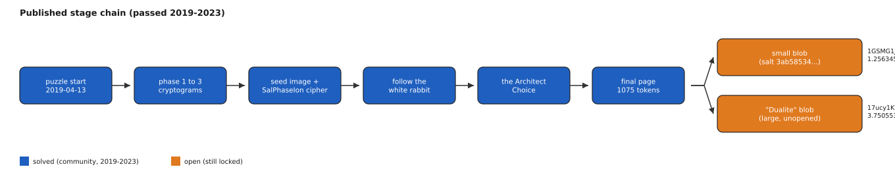
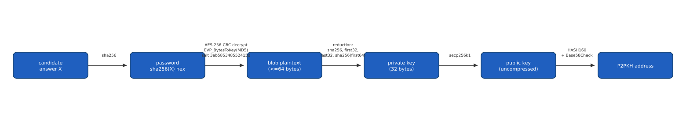

# GSMG.io Puzzle (1.2563451 BTC, [OPEN])

GSMG.io, a Netherlands-based crypto-trading platform introduced publicly in
January 2019, funded a multi-stage web puzzle with 5 BTC on 2019-04-13 and
challenged the public to solve it and keep the coins. The creator announced in
April 2019 that the reward would halve at every Bitcoin halving, and it did: 2.5 BTC
left the prize address in the first block after the 2020 halving and 1.25 BTC four
days after the 2024 one, so the live prize is the 1.2563451 BTC still held at the
original address. The 3.75 BTC moved out sits at a second address that has never
spent and has no published payout path. The puzzle chains cryptograms, an image, and
several classical ciphers across a dozen web pages; every stage since 2019 has been
passed by the community. What remains is the final gate: two still-locked
OpenSSL-format AES blobs with unknown passwords, a small one and a much larger one
nicknamed "Dualite" in the page's own markup.
The mechanical chain from the published page down to each blob is fully mapped and
reproducible; what is missing is the password (or, on the older readings, a direct
32-byte reduction) that opens either one.

## At a glance

| | |
|---|---|
| Author | pseudonymous, Telegram handle `@SoWut`, name shown as "Jrk Bgrt"; real identity not publicly resolved |
| Published | 2019-04-13, escrow funding transaction ([mempool.space](https://mempool.space/tx/73e48ff571a7e9a4387574a50cf2fcb7b21b6ea5702c777a035664df57cbce02)) |
| Prize | 1.2563451 BTC at the prize address (about $79,150 at BTC = $63,000, 2026-08-16). A further 3.7505531 BTC, moved out at the two halvings, sits at the second address below with no published payout path and is not counted |
| Chain | bitcoin |
| Escrow | `1GSMG1JC9wtdSwfwApgj2xcmJPAwx7prBe` ([explorer](https://mempool.space/address/1GSMG1JC9wtdSwfwApgj2xcmJPAwx7prBe)) and `17ucy1K9ZUAaoY6JVtM932W9jUp5LXfyHa` ([explorer](https://mempool.space/address/17ucy1K9ZUAaoY6JVtM932W9jUp5LXfyHa)) |
| Last on-chain check | 2026-09-03: 1.25635374 BTC at the prize address and 3.75055856 BTC at the split-off address, both unspent since 2024-04-24; the excess over the 2026-08-16 snapshot is third-party dust |
| Status | OPEN |
| Puzzle type | text-cipher, pixel-code, web-tree, raw-private-key |
| Target format | a candidate answer string X; password = sha256(X) hex; decrypts an OpenSSL "Salted__" AES-256-CBC blob printed on the final page; plaintext reduces to a 32-byte private key; uncompressed secp256k1 public key; P2PKH address |
| Certified oracle | yes, in two independent parts: `tools/oracle.py --selftest` (address-derivation half certified against the escrow's own on-chain public key; AES-decrypt half certified against a self-made round-trip vector; see "Certified against") |
| What remains | the password of either 80-byte lock (SalPhaseIon's small blob, or the phase 3.2.2 blob of 2019), or the preimage of the creator's unmessaged planted address of 2020-04-07, the third door; all three are exact offline oracles |
| Series | none |

## The puzzle as published

The puzzle's escrow address, `1GSMG1JC9wtdSwfwApgj2xcmJPAwx7prBe`, received its
first funding, exactly 5 BTC in a single transaction, on 2019-04-13
([txid `73e48ff5...`](https://mempool.space/tx/73e48ff571a7e9a4387574a50cf2fcb7b21b6ea5702c777a035664df57cbce02)).
GSMG.io itself, [gsmg.io](https://www.gsmg.io/), presents itself as an automated
crypto-trading platform; the puzzle is a separate, unpaid challenge run from the
same domain.

The puzzle is a chain of web pages, each unlocked by solving the one before it. A
community-maintained repository documents the public stage order
([github.com/puzzlehunt/gsmgio-5btc-puzzle](https://github.com/puzzlehunt/gsmgio-5btc-puzzle)),
and a bitcointalk thread has discussed the puzzle since 2025
([topic 5532424](https://bitcointalk.org/index.php?topic=5532424.0)): an opening
cryptogram, three numbered "phase" pages, an image page ("the seed is planted"), a
substitution-cipher page nicknamed "SalPhaseIon", a page called "follow the white
rabbit", a branching page called "the Architect Choice", and a final page. Every
stage in this chain has been passed by the community since 2019.

The final page's body is a sequence of 1075 single-character tokens. Decoded
through the page's own straightforward transforms (binary-to-ASCII on two marked
sections), two of those tokens spell out, verbatim: `matrixsumlist` and
`ourfirsthintisyourlastcommand`. The same page also embeds a 14x14 pixel image and
two base64-encoded text blocks in two separate `<textarea>` elements, the second one
titled "Dualite" in the page's own markup.


*Figure 1. The stage chain and the fork into the two final gates (source: data/stage-chain.json, script tools/fig_stages.py), 2026-08-16.*

The two outgoing transactions from `1GSMG1JC9wtdSwfwApgj2xcmJPAwx7prBe` are the
creator's own halvings of the prize, not payouts. In April 2019 the creator announced
in the puzzle's Telegram group that the reward would be halved at Bitcoin block
630,000 and again every 210,000 blocks; Y0lan collected the message ids in
[issue #15](https://github.com/floflo777/open-crypto-puzzles/issues/15) (taken as
given here, the group has no stable public URL), and the community repository's
README states the same rule. On chain, which I re-checked on 2026-09-03: in block
630,001, the first block after the 2020 halving, 2.5 BTC moved from
`1GSMG1JC9wtdSwfwApgj2xcmJPAwx7prBe` to a new address,
`17ucy1K9ZUAaoY6JVtM932W9jUp5LXfyHa`
([txid `2aa9a4a9...`](https://mempool.space/tx/2aa9a4a90be819d5122d70c993280785a0508f163521e7b38cebb4db0b071b13),
locktime 629,998). The same block carries an `OP_RETURN` reading `Halving`, sent from
the creator's vanity address `3GSMG24TujqfMJG1kQoBX18DzJHQLeJYMK` with a 700-satoshi
output to the prize address
([txid `a798905f...`](https://mempool.space/tx/a798905f53fdcadcbd2e2a1e61d23ba69a07e26130a78c76da4bf4d7a170f383)),
and the split spends that output as its third input. On 2024-04-24, four days after
the 2024 halving, 1.25 BTC moved the same way
([txid `88cdb3cd...`](https://mempool.space/tx/88cdb3cdca12b471551b1b26188508a14ca5fd8a415223ffb7c190381c9b9df3),
locktime 840,003). These are the only two spends in the prize address's history; the
remainder came back to it as change, and the small excess over 5 and 2.5 BTC on the
inputs is third-party dust. `17ucy1K9ZUAaoY6JVtM932W9jUp5LXfyHa` has never spent. No
published statement says it pays out to a solver, and Y0lan reports that when a
member asked directly in 2023 whether it does, the creator did not answer. I count
the live prize as the `1GSMG1JC9wtdSwfwApgj2xcmJPAwx7prBe` balance.

## What is understood

### Mechanism

Reaching the final page requires solving a chain of classical ciphers across the
stage sequence in Figure 1: a Vigenere-family cipher, a Bifid cipher applied to a
570-character segment with the keyed square `DBIFHCEG` and a period equal to the
full segment length, and a bit-plane reading of a 14x14 pixel image (the low bit of
each pixel's color, read in a spiral from the top-left corner, spells the ASCII
string `gsmg.io/theseedisplanted`). The Bifid step's output splits into two
interleaved streams; the odd-position stream, with the two Base58-ambiguous letters
I and O removed, reduces to exactly 256 symbols drawn from a 23-letter alphabet.
Every attempt so far to turn that 256-symbol object directly into a 32-byte private
key has failed (see "What has been tested").

The archived Phase 2 and Phase 3 page (Wayback capture of 2020-11-12 of
[`gsmg.io/choiceisanillusion...`](https://web.archive.org/web/20201112015439/https://gsmg.io/choiceisanillusioncreatedbetweenthosewithpowerandthosewithoutaveryspecialdessertiwroteitmyself)) states the puzzle's own
convention in the creator's words: "Ciphered with aes-256-cbc /w base64
sha-256(password)" and, for the seven-part phase 3 answer, "parts 1..7 -> sha-256 ->
dgst is the password". The OpenSSL password is the lowercase hex SHA-256 of the
answer, with a one-round EVP key derivation on SHA-256, and the whole solved chain
replays from archived material: the phase 2 answer opens a plaintext of 7 numbered
riddles; the 7 parts concatenated (227 characters) open the phase 3 plaintext; the
phase 3.2 answer opens a plaintext that carries the Architect's monologue as a
Beaufort block (key `thematrixhasyou`, after an EBCDIC transcoding), a 149-digit
string, a checkerboard riddle, and a further OpenSSL blob, "phase 3.2.2", never
opened. The 149 digits decode through a straddling checkerboard with escapes 1 and 4
("One for one, four for one" in the same plaintext) to the 91-letter phrase.

Two corrections to this folder follow from that replay. The Architect's monologue is
the phase 3.2 plaintext, not the text of the final page: the final page holds two
titles, the 1075 tokens and the large blob, nothing else, and six captures from
2023-06 to 2026-04 differ only in whitespace, the case of one tag and a script tag.
And there are two locks of the same shape, not one: the phase 3.2.2 blob of 2019,
preceded in its plaintext by "the private keys belong to half and better half", and
the SalPhaseIon small blob of 2021 are both `Salted__` containers with 80 bytes of
ciphertext (64 to 80 bytes of plaintext). Every password candidate is now tested
against both.

The SalPhaseIon page,
`gsmg.io/89727c598b9cd1cf8873f27cb7057f050645ddb6a7a157a110239ac0152f6a32`, reached by
hashing the text of the first puzzle page rather than through the Architect Choice,
publishes a small OpenSSL "Salted__" AES-256-CBC blob (96
bytes total: 8-byte header, 8-byte salt `3ab585348552415d`, 80 bytes of ciphertext,
enough for a 64-byte plaintext after PKCS7 padding). The password is reported to be
`sha256(X).hexdigest()` for an answer string X the solver must find; this repository
ships an oracle for exactly this half of the final gate (below). The page's second,
much larger blob, titled "Dualite", is confirmed by direct measurement (byte
histogram and autocorrelation) to be well-formed AES-CBC ciphertext rather than
noise or a decorative filler value, but no password has ever been found for it.
Whether the "Dualite" blob gates `17ucy1K9ZUAaoY6JVtM932W9jUp5LXfyHa` at all is
unconfirmed: the coins there were moved out under the halving rule, the creator has
never said they pay out, and nothing published links that blob to that address (see
"The puzzle as published"). I no longer count them as prize.


*Figure 2. The final-gate derivation pipeline `tools/oracle.py` implements for the small blob (source: data/pipeline-stages.json, script tools/fig_pipeline.py), 2026-08-16.*

### Derivation and oracle

```
python3 tools/oracle.py --selftest
python3 tools/oracle.py "<candidate answer>"
python3 tools/oracle.py --stdin
```

Given a candidate answer string X, the oracle computes `sha256(X).hexdigest()` as
the password, decrypts the small blob printed on the final page with that
password, and, if the PKCS7 padding validates, tries 4 standard readings of the
resulting plaintext (the plaintext's own SHA-256; its first 32 bytes; its last 32
bytes; the SHA-256 of its first 64 bytes) as a 32-byte private key. For each
reading it derives the uncompressed secp256k1 public key and compares the P2PKH
address against `1GSMG1JC9wtdSwfwApgj2xcmJPAwx7prBe`. `MATCH <address>
reading=<name> priv_hex=<hex> wif=<wif>` on a hit, `NO MATCH` otherwise, exit code
0 or 1. This oracle does not test the "Dualite" blob or
`17ucy1K9ZUAaoY6JVtM932W9jUp5LXfyHa`, since no password-generation hypothesis for
that blob has more support than any other (see `analysis/leads.md`).

This is a different, and independently reproducible, check from the puzzle's own
answer-checking tool referenced informally by some solvers, which is not published
and which this repository has no access to.

### Certified against

`tools/oracle.py --selftest` certifies the pipeline's two halves independently. X is
unsolved, so no vector exists for the answer string itself, but the puzzle's earlier
stages do provide real blobs with known passwords for the decryption half:

1. **Address derivation**: the escrow's own uncompressed public key, recovered from
   its 2024-04-24 spending transaction
   ([txid `88cdb3cd...`](https://mempool.space/tx/88cdb3cdca12b471551b1b26188508a14ca5fd8a415223ffb7c190381c9b9df3)),
   `04f4d1bbd91e65e2a019566a17574e97dae908b784b388891848007e4f55d5a4649c73d25fc5ed8fd7227cab0be4e576c0c6404db5aa546286563e4be12bf33559`,
   hashes byte-exact to `1GSMG1JC9wtdSwfwApgj2xcmJPAwx7prBe`. This certifies the
   HASH160-plus-Base58Check half of the pipeline against a real, independently
   checkable fact.
2. **AES decrypt**: the puzzle's own phase-2 blob, whose password is the known stage
   answer `sha256("causality")`, decrypts to its known plaintext under
   EVP_BytesToKey with SHA-256, and produces no valid PKCS7 padding under a wrong
   password. A third check asserts that EVP_BytesToKey with MD5 fails on that
   particular blob. This replaces an earlier synthetic round-trip vector, which could
   not detect a wrong digest because it encrypted and decrypted with the same
   derivation. Note that the puzzle uses both digests: phases 2 and 3 use SHA-256,
   while the Cosmic Duality blob uses MD5 (see `analysis/tested.md` sections 10 and
   11). Since the small blob's password is unknown, its digest cannot be determined,
   and the oracle tries both.
3. The published blob itself is confirmed to decode to the documented shape: 96
   bytes, header `Salted__`, salt `3ab585348552415d`.

Reproduced 2026-08-16.

### Planted addresses: an exact offline oracle for every stage

The creator's vanity wallet `3GSMG24TujqfMJG1kQoBX18DzJHQLeJYMK`
([explorer](https://mempool.space/address/3GSMG24TujqfMJG1kQoBX18DzJHQLeJYMK))
funded, on 2020-03-24, 2020-04-03 and 2020-04-07, a series of P2PKH addresses, most
with an `OP_RETURN` message. For six of them the private key is the SHA-256 of a
stage answer, address in compressed form: `causality` ("GSMG.io: Right, this is
causality"), the phase 1.2 flower sentence ("GSMG.io: are you sure?"), the
227-character concatenation of parts 1 to 7 ("GSMG.io: You are here because 227
chars were correct"), the phase 3.2 answer ("GSMG.io: phase3.2 pass OK"), the
149-digit string itself ("GSMG.io: part of the cipher"), and the prize address as a
string ("GSMG.io: do you beleive me you need it?"). Two more, both messaged "Good
job, Neo!" on 2020-04-03, use the raw 24 bytes of `gsmg.io/theseedisplanted`,
zero-padded on the left, and the same 192 bits reversed, which is the early hint
"esrever" applied to the image's binary code. One address, funded on 2020-04-07 with
no message, `1NULY7DhzuNvSDtPkFzNo6oRTZQWBqXNE9`
([explorer](https://mempool.space/address/1NULY7DhzuNvSDtPkFzNo6oRTZQWBqXNE9)), has
no known preimage; the creator named it in December 2020 as one of the two addresses
to check findings against instead of hitting the server, and a year later called the
door it stands for "still a thing" (Telegram, reported). I read it as the third door.

`data/planted-addresses.csv` lists the addresses, messages and preimages; I
re-derived every listed preimage on 2026-09-03. The consequence is an oracle the
community had the list for since 2020 and never used as one: any candidate answer for
any stage is testable offline, exactly, by hashing it (or padding its raw bytes, or
reversing its bits) into a key and comparing the compressed and uncompressed P2PKH
addresses to the list. The prize address itself is the uncompressed form of its key,
and the creator's transaction of 2021-07-18, `OP_RETURN` "GSMG.io neighbors, half
and double", pays exactly the uncompressed addresses of 2P, P/2, P+G and P-G, P being
the prize public key; the community had read those neighbours since 2021, the exact
check is mine. The second address is none of those neighbours, in either form.

### Established facts

1. `1GSMG1JC9wtdSwfwApgj2xcmJPAwx7prBe` was first funded with exactly 5 BTC on
   2019-04-13 and holds 1.25635374 BTC as of 2026-09-03 (checked via
   [mempool.space](https://mempool.space)); it has 126 transactions, of which 2 are
   spends, both by the creator.
2. Those 2 spends are the halvings of the prize: 2.5 BTC in block 630,001
   (2020-05-11, locktime 629,998) and 1.25 BTC on 2024-04-24 (locktime 840,003), each
   to `17ucy1K9ZUAaoY6JVtM932W9jUp5LXfyHa`, with the rest returned as change. The 2020
   split spends, as its third input, a 700-satoshi output of an `OP_RETURN` reading
   `Halving` sent from the creator's vanity address in the same block.
3. `17ucy1K9ZUAaoY6JVtM932W9jUp5LXfyHa` holds 3.75055856 BTC as of 2026-09-03 and has
   never spent; its balance is the two halvings plus third-party dust. The halving
   rule was announced by the creator in April 2019 (issue #15, Y0lan; community
   repository README). No published mechanism pays this balance to a solver.
4. The final page's body is 1075 single-character tokens (confirmed by direct
   extraction and byte count from an archived capture of the page).
5. The Bifid decoding of the 570-character segment (keyed square `DBIFHCEG`,
   period 570) reproduces byte for byte and starts with the plaintext `BTCSEED`.
6. The odd-position stream of that decoding, with I and O removed, is exactly 256
   characters over a 23-letter alphabet; of the 7 letter-pairs that could be
   removed from the 285-letter stream to reach exactly 256 symbols, only the I/O
   pair leaves a Base58-valid alphabet.
7. The 14x14 image, read as described above, spells `gsmg.io/theseedisplanted`
   exactly, with no residual bits.
8. The final page's HTML markup carries no additional hidden channel beyond the
   1075 tokens, the image, and the two text blocks (checked directly).
9. The creator's own convention is written on the archived Phase 2 and Phase 3
   page: AES-256-CBC, base64, password = SHA-256 of the answer; parts 1 to 7 hashed
   with SHA-256 give the next password. The chain from the image to the 91-letter
   phrase replays from archived material with that convention.
10. The Architect's monologue belongs to the phase 3.2 plaintext, not to the final
    page, which has not changed in substance between 2023-06 and 2026-04 (six
    captures). The base64 of its blob is wrapped at 64 columns, which is why the
    page encodes a line break ("enter") between the two halves.
11. Eight planted addresses have a verified preimage (six SHA-256 of a stage
    answer, one raw URL, one bit-reversed URL); the ninth, funded 2020-04-07 without
    a message, has none (`data/planted-addresses.csv`).
12. The prize address is the uncompressed form of its public key P, and the
    creator's 2021-07-18 "neighbors, half and double" transaction pays the
    uncompressed addresses of 2P, P/2, P+G and P-G exactly; the second address is
    none of 2P, P/2, P+G, P-G, 3P, 4P, P/4 in either form.
13. The community's "decrypted Cosmic Duality" is a padding accident, not a
    decryption: see `analysis/tested.md` section 14. The large blob remains closed.

## What has been tested

Full ledger in [analysis/tested.md](analysis/tested.md). Summary:

| Hypothesis | Space | Method | Result | Witness | Date |
|---|---|---|---|---|---|
| 256-symbol object reduces to a key via a letter-to-bit mask (linear and 20 spatial orders) | 335,000,000 candidates | direct address comparison | 0 match | yes | 2026-07-28 |
| 256-symbol object's alphabet splits into a 16-letter and a 7-letter group | 490,314 candidates | direct address comparison | 0 match | yes | 2026-07-28 |
| The 32 target numbers are ASCII codes of a 32-character window of a known object | 34,000 candidates | direct address comparison | 0 match | yes | 2026-07-28 |
| 256-symbol object read as a single Base58 number | 17,304 candidates | direct address comparison | 0 match | yes | 2026-07-28 |
| A substring of the object is a Base58Check string to decode | 123,728 candidates | Base58Check checksum, then address comparison | 0 match, 0 valid checksum | yes | 2026-07-28 |
| Large "Dualite" blob read directly as bits, no password | 59,269 candidates | direct address comparison | 0 match | yes | 2026-07-30 |
| Literal password strings harvested from 1,017 archived scripts, replayed under a fixed appearance filter | 116,043 candidates | AES decrypt then address comparison | 0 match | yes | 2026-07-28 |
| Small-blob pipeline swept for the first time: puzzle vocabulary, stage texts and their word windows, "last words" readings, live-page prose, the system word list, and the confirmed stage passwords | 1,358,577 candidates | corrected oracle, AES decrypt then address comparison | 0 match | yes | 2026-08-19 |
| Key derivation: the shipped oracle used EVP_BytesToKey/MD5, which fails on both puzzle blobs whose passwords are known | not a sweep | decrypt phase-2 and phase-3 blobs under both digests | MD5 refuted, SHA-256 confirmed | yes | 2026-08-19 |
| The "decrypted Cosmic Duality": 20,000 random keys against the large blob | measurement | count valid PKCS7 paddings; check the reference plaintext's byte distribution | 93 valid paddings, 92 of one byte, the reference file's exact signature; plaintext uniform; the community key works only under a convention foreign to the puzzle | yes: expected 1 in 256 | 2026-09-01 |
| Word sequences of up to 20 words from every puzzle text (monologue, 91-letter phrase, phase 3.2 intro, checkerboard riddle, 2020 poem, 2023 meta-hint, page footer, the Architect scene) and up to 15 words from the three Matrix films, as the password of both 80-byte locks (7 password forms, 2 key derivations) and as the text answer | 405,287 candidates, 24,840,284 decryptions | AES decrypt, every valid padding to the oracle | 0 match | yes: 3 synthetic blobs at head, middle and tail | 2026-09-01 |
| Stage answers and their digests as passwords of both locks: singletons, ordered and interleaved pairs, all 5,040 orders of the 7 parts, digest chains; `matrixsumlist` on the matrices never summed (14x14 image, `seg1`, `seg3` in every rectangular grid) and the page's visible strings in exact case | 19,230 candidates, 767,816 decryptions | same | 0 match | yes | 2026-09-01 |
| Interleaved planted preimages, SHA-256 iterated 1 to 64 times, the page's digit strings in every digit convention, 60 answers to the song's "which flower" question, the exact forms of the 2020 poem and of every authenticated hint, and 9,252 passwords tested for a nested OpenSSL layer inside the large blob | 237,403 candidates, 357,679 decryptions | same | 0 match | yes | 2026-09-02 |
| Every substring (2 to 300 characters) of every decoded object, in 6 forms, hashed with SHA-256 into a key, and every substring of 1 to 32 characters under the raw and bit-reversed constructions, against the planted addresses and the prize (compressed and uncompressed) | 36,481,336 candidates | direct address comparison | 0 match on the prize or the third door; the two known attributions re-found | yes: 4 known preimages injected and recovered | 2026-09-01 |
| The third door under 6 key constructions: puzzle vocabulary, the system dictionary, 2-to-6-word windows of the texts and films, `gsmg.io/` paths, permutations of the image's text and its colour numbers, 12 colour masks of the 14x14 grid in 5 reading orders, the 8 image texts in every order, "hash the text" of every page, the phase 2.1 riddle substitutions and coordinates, and prime-rank derivatives of every digit object | 25,504,681 candidates | direct address comparison | 0 match; the two "Good job, Neo!" preimages re-found by the normal path | yes | 2026-09-02 |

Cumulative: approximately 335.7 million candidates tested as direct reductions of
the 256-symbol object or the large blob, all negative; a further 116,043-candidate
partial replay of historical literal password guesses, also negative; 1,358,577
small-blob passwords on 2026-08-19; and 62,647,937 candidates on 2026-09-01 and
2026-09-02 across the two locks and the planted addresses, all negative with
witnesses. A `rockyou.txt` pass (14,344,391 words) on both locks and the third door
was still running when that session closed and is not reported. Full scope and
method notes for each row are in `analysis/tested.md`.

## Open leads, ranked

1. **The third door: the preimage of the unmessaged planted address of 2020-04-07**
   (an insight, then seconds). `1NULY7DhzuNvSDtPkFzNo6oRTZQWBqXNE9` is an exact,
   free, offline oracle at about 176,000 keys/s on one core, and everything textual
   is negative under all six key constructions: the puzzle's vocabulary, the system
   dictionary, short word windows of every text and of the three films, the image's
   text and numbers, the 8 image texts, every page hashed, the phase 2.1 riddle. What
   would open it is a rule the creator gave between the January 2020 poem and the
   April 2020 audio hint ("Yellow has a number and so does Blue", "primes", "zeroed
   out"), read on a non-textual object; or, when noise is acceptable, a GPU
   brainwallet pass over large dictionaries (SHA-256 construction) and a CPU pass for
   the raw construction (at most 32 bytes). Confirmed by an address match; killed
   family by family.
2. **Every password against both 80-byte locks, with extended readings** (seconds
   per family). The phase 3.2.2 blob (2019) and the SalPhaseIon blob (2021) have the
   same shape; "the private keys belong to half and better half" precedes the first,
   "yinyang" is announced after the second, and the creator manipulates 2P and P/2
   on the prize key. Every plaintext with valid padding is now read 40 ways (as is,
   reversed, bit-reversed, doubled, halved, plus or minus one modulo n) before the
   oracle. Confirmed by either lock opening; the families tested so far are in the
   table above.
3. **Replay the dynamically-constructed candidates a filter bug never reached**
   (hours to days). A 2026-07-28 review found that an appearance-based acceptance
   filter had silently rejected the correct answer shape in 98 of 213 historical
   scripts. A first replay resubmitted 116,043 literal strings from those scripts
   directly (0 match), but the same scripts also built candidates dynamically
   (concatenations, permutations, chained transforms) that this first replay does
   not reach. Now to be replayed against both locks and the third door.
4. **Identify the single tool reportedly used to build every phase** (hours). An
   authenticated author statement says one tool built every phase; comparing
   confirmed cipher conventions against one specific public tool's source code
   matches on non-obvious details (no period parameter on its Bifid cipher, a short
   menu of available ciphers). Confirmed by a cipher from that tool's menu
   producing a match on the "Dualite" password or the 256-object reduction; killed
   by exhausting that tool's short menu with no match.
5. **Follow "esrever" on the remaining objects** (minutes to hours). The hint is
   now explained for the object it was paired with: the bit-reversed image URL is
   the second "Good job, Neo!" key. It has not been applied to the two locks'
   plaintexts beyond the extended readings above, nor to the 256-symbol object.
6. **Read the 29 dropped letters as their own message** (minutes). Reducing the
   285-letter stream to the 256-symbol object drops exactly 29 letters, never read
   as an object in their own right. Confirmed by a match or a legible fragment;
   killed by exhausting the small set of reasonable reading orders.

Full notes: [analysis/leads.md](analysis/leads.md).

## Files in this folder

| Path | What it is |
|---|---|
| `clues/author-posts.md` | public sources for the puzzle's background and stage order, and the 2 short strings decoded verbatim from the final page's own published content |
| `data/stage-chain.json` | the published stage chain and the two final gates, for the structure figure |
| `data/pipeline-stages.json` | the 6-stage label list for the derivation pipeline figure |
| `data/planted-addresses.csv` | the creator's planted addresses with their OP_RETURN messages and verified preimages, and the one without |
| `analysis/tested.md` | the complete negatives ledger |
| `analysis/leads.md` | full notes behind the ranked leads |
| `images/01-structure-stages.svg` | the published stage chain forking into the two final gates |
| `images/02-pipeline-derivation.svg` | the final-gate derivation pipeline for the small blob |
| `tools/oracle.py` | candidate checker for the small-blob route, certified in two independent parts |
| `tools/fig_stages.py` | generates images/01-structure-stages.svg from data/stage-chain.json |
| `tools/fig_pipeline.py` | generates images/02-pipeline-derivation.svg from data/pipeline-stages.json |

## Sources

- GSMG.io, platform site: https://www.gsmg.io/
- Escrow first-funding transaction, mempool.space, 2019-04-13: https://mempool.space/tx/73e48ff571a7e9a4387574a50cf2fcb7b21b6ea5702c777a035664df57cbce02
- First transfer to the second address, mempool.space, 2020-05-11: https://mempool.space/tx/2aa9a4a90be819d5122d70c993280785a0508f163521e7b38cebb4db0b071b13
- Phase 2 and Phase 3 page with the creator's cipher convention, Wayback capture 2020-11-12: https://web.archive.org/web/20201112015439/https://gsmg.io/choiceisanillusioncreatedbetweenthosewithpowerandthosewithoutaveryspecialdessertiwroteitmyself
- The creator's vanity wallet that funded the planted addresses, mempool.space: https://mempool.space/address/3GSMG24TujqfMJG1kQoBX18DzJHQLeJYMK
- Issue #15, Y0lan, the halving rule and the second address, 2026-09-02: https://github.com/floflo777/open-crypto-puzzles/issues/15
- Second transfer to the second address (public key source), mempool.space, 2024-04-24: https://mempool.space/tx/88cdb3cdca12b471551b1b26188508a14ca5fd8a415223ffb7c190381c9b9df3
- bitcointalk topic 5532424, "Need help Puzzle GSMG.IO 5BTC": https://bitcointalk.org/index.php?topic=5532424.0
- Reddit discussion, r/bitcoinpuzzles: https://www.reddit.com/r/bitcoinpuzzles/comments/bf7siz/gsmgio_5_btc_puzzle_challenge/
- Reddit discussion, r/bitcoinpuzzles: https://www.reddit.com/r/bitcoinpuzzles/comments/dfwcqk/gsmgio_5_btc_puzzle/
- Community-maintained stage documentation: https://github.com/puzzlehunt/gsmgio-5btc-puzzle
