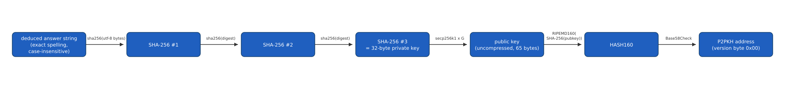
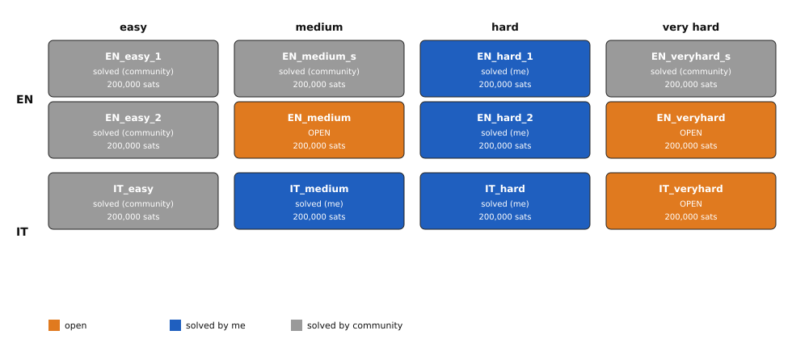
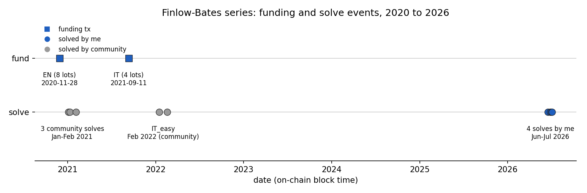

# Keir Finlow-Bates: Move Over Brokers Treasure Hunt (600,000 sats, [OPEN])

Keir Finlow-Bates embedded 12 Bitcoin puzzles inside his self-published book "Move Over
Brokers, Here Comes The Blockchain" (2020) and its Italian translation "Scansatevi
Broker" (2021): 8 English lots and 4 Italian lots, each funded with 200,000 sats. Solving
a lot means finding a specific phrase hidden in the book's prose or figures, then hashing
it with SHA-256 three times to get a private key. I solved 4 of the 12 lots myself and
collected the payouts; 5 more were already solved by other readers before I started. 3
lots remain open, worth 600,000 sats combined. The transform is understood; what is
missing for the 3 open lots is the exact answer string, most likely printed only in the
physical book.

## At a glance

| | |
|---|---|
| Author | Keir Finlow-Bates, [kf106 on Medium](https://kf106.medium.com/) |
| Published | 2020-11-28, book "Move Over Brokers, Here Comes The Blockchain" ([Kindle edition](https://www.amazon.com/Move-Over-Brokers-Comes-Blockchain-ebook/dp/B08QSH5X91)), EN escrow funded on-chain the same day |
| Prize | 600,000 sats across 3 open lots (about $378 at BTC = $63,000, 2026-08-16) |
| Chain | bitcoin |
| Escrow | 12 addresses, 1 per lot: 3 funded and unspent, 9 already spent; full ledger with explorer links in [Solution](#solution) |
| Last on-chain check | 2026-08-16: 3 lots funded and unspent (600,000 sats total), 9 lots spent |
| Status | OPEN |
| Puzzle type | book, brainwallet, text-cipher |
| Target format | exact answer string, SHA-256 applied 3 times, 32-byte private key, uncompressed P2PKH, no BIP39, no passphrase |
| Certified oracle | yes: `tools/oracle.py --selftest` (certified against EN_easy_1 = "221B Baker Street" and IT_hard = "Genova Firenze Bologna Brindisi") |
| What remains | the exact answer string for 3 lots; the ebook-accessible text and figures are exhausted, the likely gate is print-only content in the original 2020-21 print runs |
| Series | this one folder covers all 12 lots; there is no separate folder per lot |

## The puzzle as published

Finlow-Bates self-published "Move Over Brokers, Here Comes The Blockchain" in 2020 (KDP
paperback ISBN 9781688289970, Lulu hardcover ISBN 9781716479724, Kindle ebook). The book
prints 8 Bitcoin addresses, one per puzzle, each seeded with 200,000 sats; the funding
transaction for all 8 confirmed on 2020-11-28 at block 659090
(`f26ecab737b701982a7a3d0f9b0ffb3c509225cbbefecc2a4fe2e73758ce8972`, [mempool.space](https://mempool.space/tx/f26ecab737b701982a7a3d0f9b0ffb3c509225cbbefecc2a4fe2e73758ce8972)).
The Italian translation, "Scansatevi Broker" (ISBN 9798725348668, later printing ISBN
9798790431509), followed in 2021 with 4 more addresses; their funding transaction
confirmed on 2021-09-11 at block 700027
(`42919c00a64661e20b8af5719c64d58339e6e492ad21f07f4d38548768cbb23e`, [mempool.space](https://mempool.space/tx/42919c00a64661e20b8af5719c64d58339e6e492ad21f07f4d38548768cbb23e)).

Both editions embed each puzzle inside the narrative, in prose or in a figure, rather
than as a separate labeled puzzle page. The author's only public commentary on the hunt
is a retrospective article, ["Everyone Loves a Treasure Hunt"](https://kf106.medium.com/everyone-loves-a-treasure-hunt-93885ae8d80a)
(2025-09-11), which names the 12 addresses and their status but gives no clue text. He
writes there: "these won't help you, because the private keys are in the book," and "I do
not have a record of the private keys for any of the twelve puzzles out there, nor do I
have notes explaining how the puzzles are constructed." I have found no clue text, hint,
or solver write-up published anywhere online for any of the 12 lots, solved or open.

## What is understood

### Mechanism

For the 3 open lots, the confirmed transform is: deduce an exact proper-noun answer from
a clue scattered across two or more points in the book, then apply SHA-256 three times to
its UTF-8 bytes to get a 32-byte private key, then derive the uncompressed P2PKH address.
I reconstructed this transform independently on two solved lots and it reproduces both
exactly (see "Certified against" below).


*Figure 1. The sha256x3 derivation pipeline confirmed by the EN_easy_1 and IT_hard solves (source: data/pipeline-stages.json, script tools/fig_pipeline.py), 2026-08-16.*

Two other transform families are confirmed on lots I did not need to solve for the prize
(they were already spent, and in one case I solved and collected it): a printed 12-word
mnemonic with one word deliberately altered so the BIP39 checksum fails, repaired to the
nearest valid-checksum word, then BIP44 `m/44'/0'/0'/0/0` compressed (EN_hard_1, and the
same idea localized to the official BIP39 Italian wordlist for IT_medium); and key
material read directly out of a figure (EN_medium_s: a 16x16 black-and-white bitmap read
row by row, white pixels as 1 bits; EN_hard_2: 7 printed SHA-256 values in a table,
combined with XOR). The clue-signpost style is consistent across every lot I solved: a
small planted detail in one part of the book (an odd number, an unusual section heading)
points to a second, distant part of the book, and the two together name a real
proper noun.

### Derivation and oracle

```
python3 tools/oracle.py --selftest              # reproduces EN_easy_1 and IT_hard
python3 tools/oracle.py "candidate answer"       # sha256x3 mode, both key forms, all 12 lots
python3 tools/oracle.py --bip39 "twelve words"   # BIP39 mode (English or Italian wordlist)
```

A candidate answer is normalized to its exact spelling and passed through SHA-256 once,
twice, and three times; each digest is checked as both a compressed and an uncompressed
private key against all 12 lot addresses. `MATCH <lot> <address> via <method>` on a hit,
`NO MATCH` otherwise, exit code 0 or 1.

### Certified against

`tools/oracle.py --selftest` reproduces two lots I solved by reasoning about the text, not
by search: `sha256(sha256(sha256("221B Baker Street")))` derives to
`14aFhno96fkt7knLWMDQ4j8yh8v5hBF4n1` (EN_easy_1), and the same transform applied to
"Genova Firenze Bologna Brindisi" derives to `1QExGvuieS9MvuKC3R1qjp6jGTVcqisTDj`
(IT_hard). Both addresses are on the public ledger below. Reproduced 2026-08-16.

### Established facts

1. All 12 addresses are legacy P2PKH; 3 are funded and unspent as of 2026-08-16, 9 are
   already spent (checked via [mempool.space](https://mempool.space), see the ledger in
   [Solution](#solution)).
2. The sha256x3-uncompressed transform is confirmed on two lots I solved by
   reconstructing the author's clue, not by brute force: EN_easy_1 and IT_hard.
3. Two further transform families are confirmed on lots already spent: a printed 12-word
   mnemonic with a deliberately broken checksum (EN_hard_1, and its Italian-wordlist twin
   IT_medium), and key material read directly from a figure (EN_medium_s, EN_hard_2).
4. The brainwallet family (SHA-256 of the raw, unmodified book text) is refuted: it fails
   to reproduce even the two solved lots it was tested against first, so it was dropped
   for the whole series rather than swept further.
5. The author states, in his 2025-09-11 retrospective, that he keeps no record of any of
   the 12 private keys and no notes on how the puzzles were constructed.
6. No write-up exists online for any of the 5 lots solved by the community before I
   started; their answers remain unknown to me.

## What has been tested

Full ledger in [analysis/tested.md](analysis/tested.md). Summary:

| Hypothesis | Space | Method | Result | Witness | Date |
|---|---|---|---|---|---|
| Brainwallet family (SHA-256 of raw book text, 1 to 3 rounds) | refuted by construction | tested directly against the solved-lot addresses first | fails on known answers | yes: tested against known answers | 2026-07-10 |
| Systematic EN ebook mechanisms (planted numbers, flaw-and-fix nouns, acrostic reading, letter extraction, heading-to-fragment crossings, reader-instruction sites) | approximately 5,500 candidates | sha256x3, both key forms, all 12 addresses | 0 match | yes: oracle certified against EN_easy_1 and IT_hard | 2026-07-18 |
| Late per-site closures (Hoffman's canon, EN Monopoly squares, a pronoun slip) | 33 candidates | same sha256x3 oracle | 0 match | yes: same certified oracle | 2026-07-18 |
| Discography reading order as a site index (later shown to not be a real signal) | 111 candidates | same sha256x3 oracle | 0 match | yes: same certified oracle | 2026-07-14 |
| Erdos-number collaboration chain (Italian-edition-only text) | 30 candidate forms | same sha256x3 oracle | 0 match | yes: same certified oracle | 2026-07-14 |
| Pair-discipline sweep across 4 designated sites | 146 candidate pairings | same sha256x3 oracle | 0 match | yes: same certified oracle | 2026-07-14 |

Cumulative: approximately 5,820 candidates tested against the 3 open lots, 0 matches.

## Open leads, ranked

1. **Buy the physical 2020 to 2021 printed EN and IT books** (needs a person, about $40).
   Every digitally accessible surface of both editions is exhausted (see the table
   above). The author writes, of his own copies: "you hold the source of each and every
   key in your hands... as long as you have a physical copy, that is," a line present
   only in the print front matter. A used copy from the original print run is safer than
   a fresh print-on-demand reprint, since a planted flaw is known to have moved between
   IT printings. Confirmed by a detail on a physical page with no ebook counterpart;
   killed if the physical text matches the ebook captures exactly.
2. **Crack IT_easy using its exposed public key as a free calibration oracle** (hours).
   IT_easy was solved and swept by a community reader in 2022, proving its answer needs
   no print gate; its public key is exposed on-chain since it was spent from. Solving it
   would reveal the Italian answer style most likely to solve IT_veryhard. Confirmed by
   a sha256x3 candidate whose derived address or public key matches IT_easy; killed if
   the mapped Italian text (see analysis/tested.md) turns up nothing new.

Full notes: [analysis/leads.md](analysis/leads.md).

## Solution

Answers, derivation, and payouts for the 4 lots I solved. The 5 lots solved by other
readers before I started are listed with what is publicly known; their answers are not
mine to publish because I do not have them.


*Figure 2. The full 12-lot series, colored by who solved each lot (source: data/lots.csv, script tools/fig_lots.py), 2026-08-16.*

### The 12-lot ledger

| Lot | Address | State | Solved by | Date | Payout tx |
|---|---|---|---|---|---|
| EN_easy_1 | [`14aFhno96fkt7knLWMDQ4j8yh8v5hBF4n1`](https://mempool.space/address/14aFhno96fkt7knLWMDQ4j8yh8v5hBF4n1) | spent | community | 2022-01-15 | not recorded by me |
| EN_easy_2 | [`14utGQn5GdfPvUrHNLAwTmmP99QpXm9mg6`](https://mempool.space/address/14utGQn5GdfPvUrHNLAwTmmP99QpXm9mg6) | spent | community | 2021-01-04 | not recorded by me |
| EN_medium_s | [`1QFafw3weoWTRQhiLafRw2eyWbVmES6wfJ`](https://mempool.space/address/1QFafw3weoWTRQhiLafRw2eyWbVmES6wfJ) | spent | community | 2021-01-10 | not recorded by me |
| EN_medium | [`17Y9czcbcCz433QXsy1SGQjwLb27BBtLLZ`](https://mempool.space/address/17Y9czcbcCz433QXsy1SGQjwLb27BBtLLZ) | funded and unspent | none, still open | | |
| EN_hard_1 | [`181rPpfdUGFg4fVEdhDZEfDbBSqgigtoZR`](https://mempool.space/address/181rPpfdUGFg4fVEdhDZEfDbBSqgigtoZR) | spent | me | 2026-06-17 | [`b6e064aa8fde1153c342e2f7d98bce09e004bef5ac8db8f0138601289ceae69a`](https://mempool.space/tx/b6e064aa8fde1153c342e2f7d98bce09e004bef5ac8db8f0138601289ceae69a) |
| EN_hard_2 | [`161YgNX2NrCzGunWvoV1hN3DuzWeuovBK3`](https://mempool.space/address/161YgNX2NrCzGunWvoV1hN3DuzWeuovBK3) | spent | me | 2026-06-25 | [`c46c70fb04a2faeebde24057b22a547da7b309fd33b74b3d77181943a02b45d0`](https://mempool.space/tx/c46c70fb04a2faeebde24057b22a547da7b309fd33b74b3d77181943a02b45d0) |
| EN_veryhard_s | [`1KZei2D5yz3UJ59LvXsC1Y9y4ktSgcnVwz`](https://mempool.space/address/1KZei2D5yz3UJ59LvXsC1Y9y4ktSgcnVwz) | spent | community | 2021-02-05 | not recorded by me |
| EN_veryhard | [`1DZ5NbUwDgxeJkKhQLgYcUUX36PtYso1pm`](https://mempool.space/address/1DZ5NbUwDgxeJkKhQLgYcUUX36PtYso1pm) | funded and unspent | none, still open | | |
| IT_easy | [`1MEstvLAzc5DzJtvx7uyvKNNUCPN3ofWMK`](https://mempool.space/address/1MEstvLAzc5DzJtvx7uyvKNNUCPN3ofWMK) | spent | community | 2022-02-18 | not recorded by me |
| IT_medium | [`1Q78hDeaHXQbuCSQxG1uPAc4V3jsuVUG9r`](https://mempool.space/address/1Q78hDeaHXQbuCSQxG1uPAc4V3jsuVUG9r) | spent | me | 2026-07-01 | [`914a825138f943fc357b5a026b607b3c62bf67d5997043761711aaeabf5cab49`](https://mempool.space/tx/914a825138f943fc357b5a026b607b3c62bf67d5997043761711aaeabf5cab49) |
| IT_hard | [`1QExGvuieS9MvuKC3R1qjp6jGTVcqisTDj`](https://mempool.space/address/1QExGvuieS9MvuKC3R1qjp6jGTVcqisTDj) | spent | me | 2026-07-03 | [`ad999c5837e67b4d566516a70344b352c4c688e1a0781eed739be3aad3afb20c`](https://mempool.space/tx/ad999c5837e67b4d566516a70344b352c4c688e1a0781eed739be3aad3afb20c) |
| IT_veryhard | [`19kkawFcg2U2s6vq368MXD7FJU9JZvRrjA`](https://mempool.space/address/19kkawFcg2U2s6vq368MXD7FJU9JZvRrjA) | funded and unspent | none, still open | | |

All 4 payouts were sent to my wallet
[`bc1qax0hsnwnxl7393awtc3hsy0ftm6tg4tyk2nfja`](https://mempool.space/address/bc1qax0hsnwnxl7393awtc3hsy0ftm6tg4tyk2nfja).


*Figure 3. Every funding transaction and every solve, by who solved it (source: data/timeline.csv, script tools/fig_timeline.py), 2026-08-16.*

### EN_hard_1 (`181rPpfdUGFg4fVEdhDZEfDbBSqgigtoZR`)

**Answer**: a printed 12-word phrase with its last word corrected.
```
carpet baby bicycle betray shift approve barrel phrase measure prevent image brain
```
The book prints "brand" as the twelfth word, which fails the BIP39 checksum. Repairing it
to "brain," the nearest word that restores a valid checksum, is the mechanism the book's
own footnote points to.

**Derivation**: BIP39 mnemonic (English wordlist, empty passphrase) to seed, BIP44
`m/44'/0'/0'/0/0`, compressed public key.

**Key material**: private key hex `bb7431f0773cdef6bce0483556b4ad90ec85e4ea4a7d2aad0529b0d571b8bffb`,
WIF `L3W6ZhE2uqHg4e1yrj6vUZTvykYaiMSg1VNyD8CfVTy1zkfVKzcj`, address
`181rPpfdUGFg4fVEdhDZEfDbBSqgigtoZR`.

**Payout**: txid `b6e064aa8fde1153c342e2f7d98bce09e004bef5ac8db8f0138601289ceae69a`
([mempool.space](https://mempool.space/tx/b6e064aa8fde1153c342e2f7d98bce09e004bef5ac8db8f0138601289ceae69a)),
block 954149, confirmed 2026-06-17, 199,622 sats to
`bc1qax0hsnwnxl7393awtc3hsy0ftm6tg4tyk2nfja`.

**What it teaches about the series**: this is the only EN lot solved by repairing a
broken BIP39 checksum rather than deducing a free-text answer. It set up the localized
IT_medium solve (same mechanism, Italian wordlist) and gives a reusable filter: any
printed 12 or 24-word list in either book is worth a checksum check before anything else.

**How I got there**: I found the printed phrase, confirmed its checksum was invalid,
regenerated it against every English BIP39 word in the last slot, and kept the single
result with a valid checksum. It matched the target on the first and only valid
candidate.

### EN_hard_2 (`161YgNX2NrCzGunWvoV1hN3DuzWeuovBK3`)

**Answer**: not a text phrase. The key is the XOR of 7 SHA-256 values printed in Figure
10 ("A hash function-generated one-time password pad"), a table built from a
deliberately altered pangram.

**Derivation**: XOR the 7 printed 256-bit hex values together, use the 32-byte result
directly as the private key, uncompressed public key.

**Key material**: private key hex `9dd0f77d3cc6746cdfe779de61499a88ba4a7fc6a53f90dc276a0c2826679be8`,
WIF `5K1nnZxtT1kDxbzjkwK6GUYBWApcUMDpLVpKNgSvpGxLYhruRTB`, address
`161YgNX2NrCzGunWvoV1hN3DuzWeuovBK3`.

**Payout**: txid `c46c70fb04a2faeebde24057b22a547da7b309fd33b74b3d77181943a02b45d0`
([mempool.space](https://mempool.space/tx/c46c70fb04a2faeebde24057b22a547da7b309fd33b74b3d77181943a02b45d0)),
block 955367, confirmed 2026-06-25, 199,600 sats to
`bc1qax0hsnwnxl7393awtc3hsy0ftm6tg4tyk2nfja`.

**What it teaches about the series**: the printed phrase in the same figure is a red
herring; the key material is the numeric table next to it, combined by XOR, not any hash
of the phrase itself. Any figure printing a list of hex values or numbers (Figure 9's
bitmap, Figure 11, Figure 16, Figure 17) is worth checking as direct key material before
assuming it needs a text answer.

**How I got there**: I had already ruled out every text-derived reading of the chapter's
pangram. Re-reading the figure caption as a literal instruction ("one-time password pad")
led me to combine the table rows directly rather than hash the caption text.

### IT_medium (`1Q78hDeaHXQbuCSQxG1uPAc4V3jsuVUG9r`)

**Answer**: 12 English words printed in the Italian edition's entropy-explanation
passage, each translated to its official BIP39-Italian equivalent.
```
orologio snervato mugnaio enzima scienza glutine spargere valletta diametro pianta totano civetta
```
Four of the twelve English words had two plausible Italian translations each; of the 64
resulting combinations, exactly 4 had a valid BIP39 checksum, and exactly one of those 4
derived the target address.

**Derivation**: BIP39 mnemonic (Italian wordlist, empty passphrase) to seed, BIP44
`m/44'/0'/0'/0/0`, compressed public key.

**Key material**: private key hex `578df2fef081d6c5430a5a815515412930ee5d6cf6b0f92aab04a4a121067ecd`,
WIF `Kz9uTuc4bo9FczbmcuAeuXqeV9AHQnpV8U56dKeepoKxnqccDboF`, address
`1Q78hDeaHXQbuCSQxG1uPAc4V3jsuVUG9r`.

**Payout**: txid `914a825138f943fc357b5a026b607b3c62bf67d5997043761711aaeabf5cab49`
([mempool.space](https://mempool.space/tx/914a825138f943fc357b5a026b607b3c62bf67d5997043761711aaeabf5cab49)),
block 956264, confirmed 2026-07-01, 199,600 sats to
`bc1qax0hsnwnxl7393awtc3hsy0ftm6tg4tyk2nfja`.

**What it teaches about the series**: this is the localization pattern. The Italian
edition reuses an EN artifact type (here, the entropy-passage mnemonic from EN_hard_1)
with new content, and the puzzle is to notice which standard the localized content maps
to. It is the strongest lead for IT_veryhard: look for another artifact present in both
editions where the IT content differs from the EN content.

**How I got there**: the EN and IT editions print a different 12-word phrase in the same
spot; where the EN phrase is a broken English BIP39 mnemonic, the IT phrase reads as
ordinary Italian words with no direct wordlist match, until translated to the official
BIP39-Italian wordlist.

### IT_hard (`1QExGvuieS9MvuKC3R1qjp6jGTVcqisTDj`)

**Answer**: four Italian city names, in reading order, from a paragraph unique to the
Italian edition's front matter, thanking 3 named people for a trip: "Genova Firenze
Bologna Brindisi."

**Derivation**: SHA-256 applied three times to the UTF-8 bytes of the answer string,
uncompressed public key.

**Key material**: private key hex `b99d16572661d00fd7a18a6b4ed6e7311eb930798c790b573c8942ca4b12e37f`,
WIF `5KE2qELS41zdVG1e6mu3wNE2hJCejty1f1GAvCCrgGyuX57ERQt`, address
`1QExGvuieS9MvuKC3R1qjp6jGTVcqisTDj`.

**Payout**: txid `ad999c5837e67b4d566516a70344b352c4c688e1a0781eed739be3aad3afb20c`
([mempool.space](https://mempool.space/tx/ad999c5837e67b4d566516a70344b352c4c688e1a0781eed739be3aad3afb20c)),
block 956560, confirmed 2026-07-03, 199,600 sats to
`bc1qax0hsnwnxl7393awtc3hsy0ftm6tg4tyk2nfja`.

**What it teaches about the series**: the signpost naming exactly 3 people, thanked for
"non sarei riuscito a farlo senza voi tre" (I could not have done it without you three),
points at the three-times hashing rule, the same device used for EN_easy_1 ("check it on
your calculator" pointing at the number 221). The answer source was IT-only personal
prose, not a spot-the-error flaw like the other IT lots I solved: the same lens applied
to IT_veryhard should look for another IT-only prose detail or named list.

**How I got there**: after several deliberate-flaw hypotheses failed, I treated the
Italian-only acknowledgements section as unconverted signal (it has no English
counterpart at all) and tested its four named cities directly. It matched on the first
reasoned attempt.

### The 5 community-solved lots

EN_easy_1, EN_easy_2, EN_medium_s, EN_veryhard_s, and IT_easy were all solved and swept
by other readers before I started this research, between 2021-01-04 and 2022-02-18. I
reconstructed the EN_easy_1 answer independently afterward by reasoning about the text
(see "How I got there" would apply the same way, but the reward was already claimed by
the original solver in 2022, so no payout exists for me on this lot). I do not know the
answers to EN_easy_2, EN_medium_s, EN_veryhard_s, or IT_easy: none of their solvers
published a write-up, and their public keys, where exposed on-chain by the spending
transaction, are calibration data, not a shortcut to the answer text.

## Files in this folder

| Path | What it is |
|---|---|
| `clues/author-posts.md` | short, dated quotes from the author's own retrospective article and book front matter, with links |
| `data/lots.csv` | the 12-lot ledger (address, state, solver, date), from on-chain checks and my solved-lot write-ups |
| `data/timeline.csv` | every funding and solve transaction, block height and date, from mempool.space |
| `data/pipeline-stages.json` | the 7-stage label list for the derivation pipeline figure |
| `analysis/tested.md` | the complete negatives ledger for the 3 open lots |
| `analysis/leads.md` | full notes behind the 2 ranked leads |
| `images/01-pipeline-derivation.svg` | the sha256x3 derivation pipeline diagram |
| `images/02-structure-lots.svg` | the 12-lot series grid, colored by who solved each lot |
| `images/03-timeline-funding.png` | funding and solve events plotted from 2020 to 2026 |
| `tools/oracle.py` | candidate checker, sha256x3 and BIP39 modes, both certified |
| `tools/fig_pipeline.py` | generates images/01-pipeline-derivation.svg from data/pipeline-stages.json |
| `tools/fig_lots.py` | generates images/02-structure-lots.svg from data/lots.csv |
| `tools/fig_timeline.py` | generates images/03-timeline-funding.png from data/timeline.csv |

## Sources

- Keir Finlow-Bates, "Everyone Loves a Treasure Hunt", Medium, 2025-09-11: https://kf106.medium.com/everyone-loves-a-treasure-hunt-93885ae8d80a
- "Move Over Brokers, Here Comes The Blockchain" (Kindle edition), Amazon, purchase link: https://www.amazon.com/Move-Over-Brokers-Comes-Blockchain-ebook/dp/B08QSH5X91
- EN escrow funding transaction, mempool.space: https://mempool.space/tx/f26ecab737b701982a7a3d0f9b0ffb3c509225cbbefecc2a4fe2e73758ce8972
- IT escrow funding transaction, mempool.space: https://mempool.space/tx/42919c00a64661e20b8af5719c64d58339e6e492ad21f07f4d38548768cbb23e
- EN_hard_1 payout, mempool.space: https://mempool.space/tx/b6e064aa8fde1153c342e2f7d98bce09e004bef5ac8db8f0138601289ceae69a
- EN_hard_2 payout, mempool.space: https://mempool.space/tx/c46c70fb04a2faeebde24057b22a547da7b309fd33b74b3d77181943a02b45d0
- IT_medium payout, mempool.space: https://mempool.space/tx/914a825138f943fc357b5a026b607b3c62bf67d5997043761711aaeabf5cab49
- IT_hard payout, mempool.space: https://mempool.space/tx/ad999c5837e67b4d566516a70344b352c4c688e1a0781eed739be3aad3afb20c
