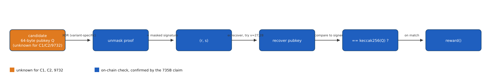
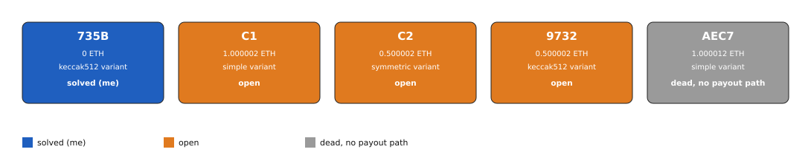

# Mechanism, in full

## The scheme

Johan Nygren's "Teikhos" scheme (Greek for "fortification") is a way to prove ownership of a public
key without ever publishing that key on chain. At deployment, the contract's creator signs a
fixed message with their private key, producing a signature `(r, s)`. The creator then masks
`(r, s)` by XOR against their own public key `Q` (or against a value derived from `Q`,
depending on the variant) and stores only the masked result. Nothing about `Q` is visible on
chain: the only trace of it is `keccak256(Q)`, a one-way hash, used as the target address.

To claim the bounty, a solver submits a candidate 64-byte public key `Q'` to `authenticate()`.
The contract reverses the masking with `Q'` to recover a candidate `(r, s)`, computes
`signer = address(keccak256(Q'))`, and checks with `ecrecover` whether `(r, s)` is a valid
signature of a fixed message under `signer`. This only happens if `Q'` is exactly the real
`Q`: masking and `ecrecover` are both deterministic functions of `Q` alone, so there is no
free parameter to search over except `Q` itself, a full 256-bit space with no shortcut from
the contract's math.

*Figure 1. The authenticate() check, confirmed against the real solution used to claim 735B (source: data/pipeline-stages.json, script tools/fig_pipeline.py), 2026-08-16.*

## Three masking variants across the family

The same creator address, `0x4c5D24A7Ca972aeA90Cc040DA6770A13Fc7D4d9A`, deployed 5 contracts
between 2018-02-25 and later in 2018, each with the same `authenticate()` idea but a
different masking step, confirmed from each contract's verified source or, where source was
not available to me, from the values actually stored on chain:

- **simple** (AEC7, C1): `r = proof1 XOR Q[0:32]`, `s = proof2 XOR Q[32:64]`.
- **symmetric** (C2): an extra XOR layer. `symKey = sym XOR Q`, then
  `r = proof1 XOR symKey[0:32]`, `s = proof2 XOR symKey[32:64]`.
- **keccak512** (9732, 735B): `base = keccak512(Q)`, then `r = proof1 XOR base[0:32]`,
  `s = proof2 XOR base[32:64]`. This is a commit-reveal design: solving sets a `winner` in
  storage, and `reward()` pays out only after a 7-day delay, rather than paying the caller
  immediately.

9732's variant is recorded here as keccak512 by analogy with its twin 735B (same creator,
same balance class, matching bytecode length), not independently re-derived from a verified
source in this session; its proof values themselves are reconfirmed live on chain (see
Established facts).

*Figure 2. The full contract family, colored by state and labeled with balance and masking variant (source: data/contracts.csv, script tools/fig_family.py), 2026-08-16.*

## Why AEC7 cannot pay anyone

AEC7 (1.000012 ETH) is a prototype version of the scheme. Its `authenticate()` function only
returns a boolean; a full disassembly of its 911-byte runtime shows the two `CALL`
instructions both target the `ecrecover` precompile with zero value, and the code path stops
at a `STOP` opcode before any `SELFDESTRUCT` or value-transfer instruction. What looks like a
`SELFDESTRUCT` signature in the raw bytecode is the Swarm/CBOR metadata trailer the Solidity
compiler appends after the real code, not an executable instruction. There is no payout path
in this contract for anyone, including its own creator, even with the correct public key.

## Why C1 and C2 are front-run risks and 9732 is not

C1 and C2 use `suicide(msg.sender)`: whoever's transaction successfully calls `authenticate()`
receives the balance directly. A correct public key placed in a public mempool transaction can
be copied and resubmitted by another party's transaction with higher gas before the original
confirms; solving either of these safely means submitting through a private relay rather than
a public mempool. 9732 (and 735B before it was solved) instead uses a commit-reveal flow: an
`authenticate()` call sets a `winner` address without paying out immediately, followed by a
7-day delay before `reward()` sends the balance to that stored winner, which removes the
front-running risk since the payout goes to the winner already on record, not to whoever calls
`reward()`.
