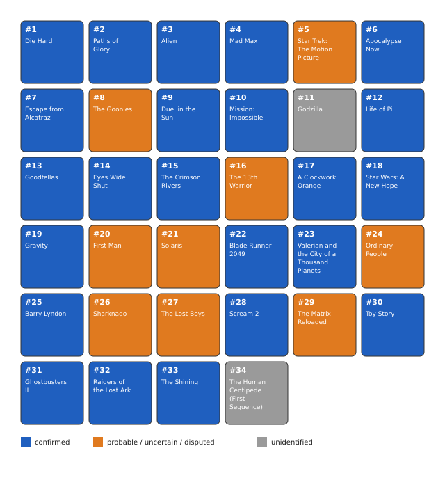

# Bitcoin Movie Enigma (100,000 sats, [OPEN])

"klems" published this puzzle across Nostr, X, and Instagram in January 2024: 34
numbered panels, each a still from a different movie, that together encode a
24-word BIP39 seed phrase for a wallet funded with 100,000 sats. The rules, still
published on the author's own site, describe a two-step transform: turn each of the
34 movie titles into an English BIP39 word, then drop 10 "intruder" words using
information found on each film's IMDb page, leaving the real 24-word seed in panel
order. The derivation is fully understood and bounded once the inputs are known.
What is missing is entirely cultural: all 34 films now have an identification
(the community list in `data/films_community_issue9.csv`, checked against the
published stills by AppleLamps on 2026-08-27, with panel 14 settled by a frame
match on 2026-09-03), and I have not yet found either the title-to-word rule for
The Goonies or the IMDb field that splits the 24 keepers from the 10 intruders.
Every mechanical reading of those two rules I could formulate on the consensus list
is negative (12 sweeps, 2026-09-01 and 2026-09-02).

## At a glance

| | |
|---|---|
| Author | klems, [Nostr npub10q5dpm5p05a0g3vtgcl76wv0pc4t820f5fj8qmpfaa4umv6404xqvwzvp0](https://njump.me/npub10q5dpm5p05a0g3vtgcl76wv0pc4t820f5fj8qmpfaa4umv6404xqvwzvp0) |
| Published | 2024-01-03, Nostr, X and Instagram ([rules](https://bitcoinmovieenigma.com/rules)) |
| Prize | 100,000 sats (about $63 at BTC = $63,000, 2026-08-16) |
| Chain | bitcoin |
| Escrow | `bc1q94ecsn0qk8lap2gefrycnms3ruepy889z969a6` ([explorer](https://mempool.space/address/bc1q94ecsn0qk8lap2gefrycnms3ruepy889z969a6)) |
| Last on-chain check | 2026-09-01: funded and unspent (100,000 sats) |
| Status | OPEN |
| Puzzle type | bip39-seed, text-cipher, word-selection |
| Target format | BIP39 24 words (English), most likely BIP84 `m/84'/0'/0'/0/i` (script type `v0_p2wpkh`), no passphrase stated |
| Certified oracle | yes: `tools/oracle.py --selftest` (certified against the public BIP39/BIP84 test vectors) |
| What remains | the title-to-word rule for The Goonies, and the IMDb field that drops 10 of 34 words; the natural candidate for the field, 5 Kubrick films plus 5 Jean Reno films, is negative at one wildcard and untested at two |
| Series | none |

## The puzzle as published

The rules page, still live at [bitcoinmovieenigma.com/rules](https://bitcoinmovieenigma.com/rules),
states the mechanism directly:

> "Guess all the 34 movie titles, from the provided movie frames."

> "Transform 'somehow' each movie title into an English BIP-0039 seed word."

> "The seedphrase you have is 34 words long, but we should have a 24 words
> seedphrase instead. Some movies should not be in the sequence, and should be
> considered intruders, but which ones? You will need additional informations
> about each movie to detect those intruders 'somehow'. Every information you need
> can be found on IMBD, on each movie's page."

> "Once you got rid of the intruders, you can restore the Bitcoin wallet using the
> 24 words passphrase with any compatible software."

The 34 panels were posted one per day (by their displayed date, 2024-01-03 through
2024-02-05) on the author's Nostr account and cross-posted to X and Instagram,
later mirrored to a dedicated site because, in the author's own words on the site's
about page, "some platforms compressed the movie frames poorly." Each panel is a
still from a different film; I do not reproduce them here, since they are
third-party film frames and the site hosting them is still live (see
[clues/author-posts.md](clues/author-posts.md) for direct links and further
quotes). A separate "alternative release" republishes the same 34 stills as a
single combined image; I confirmed byte for byte that all 34 match the individual
panels exactly, so it carries no extra information.

The escrow's wallet page names the address directly and lists the author's own
funding entry, "100000 | 4/08/2022," in a donation ledger, which matches the
escrow's on-chain funding date and resolves what would otherwise look like an
unexplained 21-month gap between funding and the January 2024 launch: the wallet
was pre-funded as a donation well before the puzzle was announced.

## What is understood

### Mechanism

Each of the 34 panels is one movie still, in a fixed panel order. Identifying the
34 titles and transforming each into an English BIP39 word gives a 34-word
sequence. Ten of those 34 words are "intruders" to be identified and dropped using
information on each film's IMDb page, leaving the real 24-word mnemonic in panel
order. The escrow's script type, `v0_p2wpkh`, points to BIP84 as the most likely
derivation, though the author never states the path directly, so the oracle also
checks BIP49, BIP44, and 3 raw derivation paths some simple wallets use.

### Derivation and oracle

```
python3 tools/oracle.py --selftest
python3 tools/oracle.py "w1 w2 ... w24"
```

The oracle validates a 24-word candidate as a BIP39 mnemonic, derives every
plausible address (BIP84, BIP49 and BIP44 across 2 accounts and 3 indices each,
plus 3 raw paths), and compares each to the escrow address. `MATCH <address> via
<path>` on a hit, `NO MATCH` otherwise. To check which 10 of 34 known words to
drop, generate the 24-word reductions yourself and pipe them through `--stdin`;
the puzzle's own arithmetic bounds this to C(34,10) = 131,128,140 raw combinations,
cut by the BIP39 checksum (1 in 256) to about 512,000 candidates, which costs on
the order of an hour end to end with this pure-Python, bip_utils-only oracle. That
bound only applies once all 34 words and their order are known, which is not yet
the case here.

### Certified against

No solved sibling exists for this puzzle, so `tools/oracle.py --selftest` certifies
the derivation path against the public BIP39/BIP84 test vectors: the 12-word
mnemonic "abandon" repeated 11 times plus "about" derives address
`bc1qcr8te4kr609gcawutmrza0j4xv80jy8z306fyu`, and the 24-word mnemonic "abandon"
repeated 23 times plus "art" is confirmed to be checksum-valid and to derive a
non-empty address; a 1-word-off variant is correctly rejected by the checksum.
Reproduced 2026-08-16.

### Established facts

1. The escrow is funded and unspent as of 2026-08-27 (checked via
   [mempool.space](https://mempool.space)); the single funding transaction
   confirmed 2022-04-08 at block 730990.
2. The escrow's own wallet page names the address and lists the author's funding
   entry with the same date, resolving the apparent gap between funding and launch.
3. Both published image sets (individual panels and the "alternative release") are
   byte-for-byte identical, 34 of 34, confirmed by MD5.
4. All 34 panels now have an identification. Panel 11 (Godzilla) and panel 34
   (The Human Centipede) were closed by community reports in August 2026 (issues
   #9, #3). On 2026-08-27 AppleLamps checked the nine remaining disagreements with
   the 2026-08-04 pass against the published stills; six are confirmed from the
   still itself (panels 3, 5, 14, 16, 23, 27) and three stay confirmed-community
   (panels 9, 13, 24). Panel 14, which I had read as Eyes Wide Shut, was the last
   one I held open: on 2026-08-29 deviceio121 linked MGM's official clip of The
   Man in the Iron Mask (issue #9), and its 2:18 frame is the panel's own
   masked-ball shot, so panel 14 is The Man in the Iron Mask (words `iron`,
   `mask`, `man`, `ask`). The merged list is `data/films.csv`.
5. A unique 4-letter BIP39 prefix scan of each title with spaces removed produces
   a word for 33 of 34 titles. The only title with no prefix and no literal
   substring is The Goonies (panel 8). Leon maps to `profit`, Sharknado to
   `share`, Raiders of the Lost Ark to `soft`, The Shining to `shine`.
6. About 25 to 30 candidate IMDb-field criteria for the 10 intruders have been
   tried against earlier film lists; none produces an exact 24-versus-10 split
   that then matches the escrow (`analysis/tested.md`).
7. The 34 published PNG stills all carry the same EXIF/XMP decoy: description
   "nope", creator `@cryptop1r4t3`.
8. `@cryptop1r4t3` is the author's X account. It posted the same 34 stills, in the
   same order, on 2022-04-08, the day the escrow was funded, with the lines "80%
   movie quiz and 20% reflexion" and "i might add clues" (no clue was ever added);
   the January 2024 launch on Nostr, X and Instagram was a re-launch of a puzzle that
   had been "still ongoing, never been found" for 21 months (read on 2026-09-01;
   the account's earlier hunts were physical caches with BIP39-word passphrases).
9. The Nostr launch note of 2024-01-03 is more precise than the site's rules page:
   "34 movies screenshot will be posted in the proper order", "find the trick to
   match a movie name with a word on that list", intruders detected from "Director /
   Year of release / Length / Actors starring in it / etc ... nothing outside the
   first page of IMDB", and "no fancy cryptic enigma or complex calculations"
   (`clues/author-posts.md`).
10. Three IMDb readings split the consensus list into exactly 24 and 10: the 5
    films directed by Stanley Kubrick (panels 2, 9, 17, 25, 33) plus the 5 starring
    Jean Reno (panels 10, 11, 13, 15, 16), the author's own two example fields;
    release year 2000 or later (12, 15, 19, 20, 21, 22, 23, 26, 29, 34); and release
    year before 1980 (2, 4, 5, 6, 7, 9, 17, 18, 24, 25). The Kubrick plus Reno
    split needs panel 14 to be The Man in the Iron Mask, which it is.


*Figure 1. Identification status of the 34 panels, no film stills reproduced (source: data/films.csv, script tools/fig_panel_grid.py), 2026-09-03.*

## What has been tested

Full ledger in [analysis/tested.md](analysis/tested.md). Summary:

| Hypothesis | Space | Method | Result | Witness | Date |
|---|---|---|---|---|---|
| Both image sets carry different information | 34 panels compared | byte-for-byte MD5 comparison | identical, 34/34 | yes: direct comparison, independently reproducible | 2026-08-03 |
| Intruders = MPAA rated R | recount as films are identified | direct count over the film corpus | looked correct at 10/18, refuted at 16-18/34 | n/a: direct count, re-checkable from data/films.csv | 2026-08-04 |
| Intruders = won at least 1 Oscar | recount as films are identified | direct count | looked correct at 10/21, refuted at 11/34 | n/a: direct count | 2026-08-04 |
| Intruders = adapted from a novel | recount as films are identified | direct count | looked correct at 10/31, refuted at 12/34 | n/a: direct count | 2026-08-04 |
| About 25 further IMDb-field criteria | recount as films are identified | direct count | none reaches an exact 24/10 split | n/a: direct count | 2026-08-04 |
| PNG EXIF/XMP carries a title or word | 34 published crops | read EXIF and XMP | decoy only: description "nope", creator @cryptop1r4t3, 34/34 identical | yes: all 34 XMP packets compare equal | 2026-08-27 |
| Unique BIP39 4-letter prefix in the compact title | 34 titles | prefix scan against the English wordlist | 33/34 titles yield a word; only The Goonies yields none | n/a: direct scan, re-checkable from data/films.csv | 2026-08-27 |
| Intruders = G, PG, and TV-14 on the reconciled list | 55,296 raw 24-word strings, 227 checksum-valid | certified oracle, BIP84/49/44 plus 3 raw paths | 0 match | uncertified: no known-good mnemonic for this escrow to plant in the loop | 2026-08-27 |
| Intruders = the wordless titles plus any others, literal words and substrings of 3 or more letters, on the consensus list and on the older identifications (5 runs) | 1.6e10 raw candidates, 62,644,358 derivations | checksum filter in C, then BIP84/44/49/86 and raw paths on CPU or a 24-word GPU port of the shared engine | 0 match | yes: 3 synthetic 24-word witnesses at head, middle and tail of each run, all recovered, plus the public BIP84 vector | 2026-09-01 |
| The natural 24-title partition through 178 derivation paths; one free position over 2048 words; Kubrick x5 plus Reno x5 at one wildcard; year or runtime as a BIP39 index; 6 prefix rules; 40 neighbour rules (7 runs) | 1.5e9 raw candidates, 6,534,857 derivations | same | 0 match | uncertified: oracle vector only, no planted witness in those runs | 2026-09-02 |

## Open leads, ranked

1. **Find the title-to-word rule for The Goonies** (needs an insight). Under
   both a literal substring scan and a unique 4-letter BIP39 prefix scan of the
   compact title, panel 8 is the only remaining title with no English BIP39 word.
   Leon, Sharknado, Raiders of the Lost Ark, and The Shining all resolve once
   spaces are ignored. A rule that also drops panel 8 as an intruder is cheaper
   than one that keeps it.
2. **Kubrick x5 plus Jean Reno x5 at two wildcards** (minutes on one GPU). The
   author's own example fields, director and actors, name exactly 10 films on the
   consensus list. At one wildcard (panel 8 free) it is negative. Two wildcards,
   panels 8 and 26 or 8 and 32 with the other read as `share`, `tornado`, `soft`
   or `ride`, is about 6.4e9 raw candidates and 2.5e7 derivations per pair,
   about 3 minutes each on one GPU. Confirmed by a MATCH; killed by both pairs
   coming back empty with witnesses.
3. **Find the IMDb field that splits 24 keepers from 10 intruders** (needs an
   insight). Certificate G/PG/TV-14 on the reconciled list selects exactly 10
   panels and was tested through the oracle (55,296 raw strings, 0 match,
   uncertified). The three GPU metadata sweeps reported in issue #9 are empty
   against a different word list; year 2000 or later and year before 1980 are
   negative here at one wildcard.
4. **Regional IMDb titles and AKAs for the wordless titles** (hours, no compute).
   couldes noted in issue #9 that IMDb pages differ by region and some carry a
   subtitle. The word step reads from the film, so a regional subtitle is not in
   scope by default, but for The Goonies, Sharknado and Raiders an alternate title
   is the cheapest place a word could hide (Sharknado's German title "Dark Skies"
   gives `ski`, already swept as a widened ambiguity).
5. **Re-check panels 9, 13 and 24 against the issue #9 sources** (needs a
   person, likely under an hour). Spartacus, Leon: The Professional, and Close
   Encounters of the Third Kind are the last identifications that rest on the
   issue #9 sources rather than on a frame matched independently.

## Files in this folder

| Path | What it is |
|---|---|
| `clues/author-posts.md` | verbatim quotes from the rules, about and wallet pages, with links; no film stills reproduced |
| `data/films.csv` | my identification state for all 34 panels: title, MPAA rating, confidence, candidate BIP39 words |
| `analysis/tested.md` | the complete negatives ledger |
| `analysis/leads.md` | full notes behind the ranked leads |
| `images/02-panel-grid-identification.svg` | the 34-panel identification status grid |
| `tools/oracle.py` | candidate checker, certified against the public BIP39/BIP84 test vectors |
| `tools/fig_panel_grid.py` | generates images/02-panel-grid-identification.svg from data/films.csv |

## Sources

- Bitcoin Movie Enigma, rules page: https://bitcoinmovieenigma.com/rules
- Bitcoin Movie Enigma, about page: https://bitcoinmovieenigma.com/about
- Bitcoin Movie Enigma, wallet page: https://bitcoinmovieenigma.com/wallet
- klems, Nostr launch note with the rules, 2024-01-03: https://njump.me/48fbbff9845680b463784d5ddfdc5907a953b3f4df9e0e49a97d6eb123d52145
- klems, X account named in the panels' EXIF, first launch 2022-04-08: https://x.com/cryptop1r4t3
- deviceio121, MGM's official The Man in the Iron Mask clip whose 2:18 frame is panel 14, issue #9, 2026-08-29: https://www.youtube.com/watch?v=3PcEZNC7IPw
